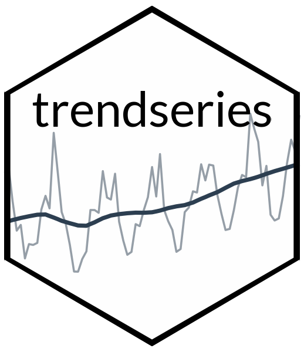
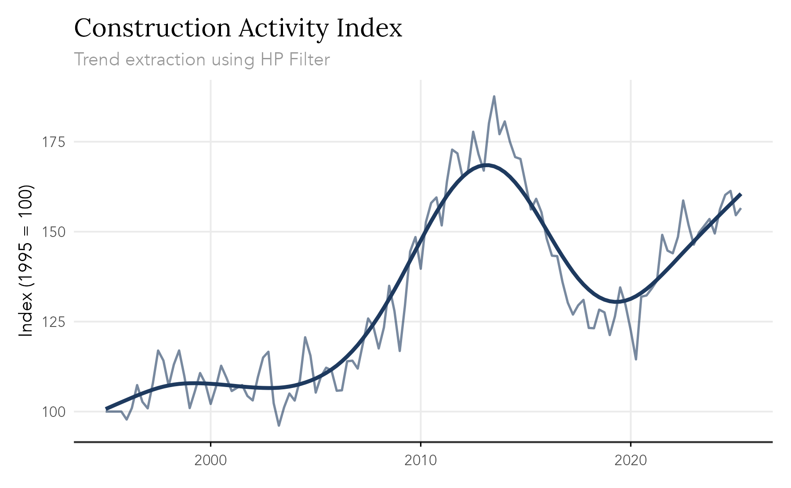

<!-- README.md is generated from README.Rmd. Please edit that file -->

```{r, include = FALSE}
knitr::opts_chunk$set(
  collapse = TRUE,
  comment = "#>",
  fig.path = "man/figures/README-",
  out.width = "100%",
  fig.align = "center",
  fig.width = 7,
  warning = FALSE,
  dev = "svg"
)
```

# trendseries

<!-- badges: start -->


[](https://CRAN.R-project.org/package=trendseries)

<!-- badges: end -->

The goal of `trendseries` is to provide a modern, pipe-friendly interface for exploratory analysis of time series data in conventional `data.frame` format. Time series have a specific structure in R (`ts`) and most filtering methods are designed for `ts` objects. `trendseries` bridges this gap by keeping the data in a `data.frame` format and adding trend columns to the original dataset.

The philosophy of `trendseries` is to sacrifice some precision for simplicity and flexibility. In this sense, its mainly a companion for EDA and visualization pipelines.

## Installation

`trendseries` is available on CRAN

```{r, eval = FALSE}
install.packages("trendseries")
```

You can install the development version of trendseries from [GitHub](https://github.com/).

``` r
# install.packages("remotes")
remotes::install_github("viniciusoike/trendseries")
```

## Main Functions

The package provides two main functions:

-   **`augment_trends()`**: adds trend columns to `tibble`/`data.frame`/`data.table`.
-   **`extract_trends()`**: extracts trends from `ts`/`xts`/`zoo`.

## Usage

Time series have a specific structure in R (`ts`) and most filtering methods are designed for `ts` objects. However, datasets typically come in a `data.frame` format with a date column, which can make applying filters cumbersome.

`trendseries` aims to make this process easy and flexible. The example below computes three filters (HP, STL, and moving average) on a quarterly index of construction activity. Note that the `augment_trends()` function automatically detects the frequency of the data and uses conventional defaults for the HP filter.

```{r}
library(trendseries)
library(ggplot2)
data(gdp_construction)
# Computes multiple trends at once
series <- gdp_construction |>
  # Automatically detects frequency
  # Trends are added as new columns to the original dataset
  augment_trends(
    value_col = "index",
    methods = c("hp", "stl", "ma")
  )

series
```



An equivalent `extract_trends()` function is also available for `ts` objects.

```{r}
stl_trend <- extract_trends(AirPassengers, methods = "stl")
plot.ts(AirPassengers)
lines(stl_trend, col = "#C53030")
```

## Available Methods

`trendseries` supports many trend estimation methods. The overall goal is to support the most commonly used methods in econometrics and statistics. A non-exhaustive list is presented below.

| Method     | Description                         |
|------------|-------------------------------------|
| `loess`    | Local polynomial regression         |
| `spline`   | Smoothing splines                   |
| `poly`     | Polynomial trends                   |
| `median`   | Median filter                       |
| `stl`      | Seasonal-trend decomposition        |
| `ma`       | Simple moving average               |
| `wma`      | Weighted moving average             |
| `kalman`   | Kalman filter/smoother              |
| `ucm`      | Unobserved components model         |
| `hp`       | Hodrick-Prescott filter             |
| `hamilton` | Hamilton regression filter          |
| `bk`       | Baxter-King bandpass filter         |
| `bn`       | Beveridge-Nelson decomposition      |
| `cf`       | Christiano-Fitzgerald filter        |

## Learn More

See the vignettes for detailed examples and usage patterns:

-   [Introduction to trendseries](https://viniciusoike.github.io/trendseries/articles/trendseries.html)

-   [Moving Averages](https://viniciusoike.github.io/trendseries/articles/moving-averages.html)
