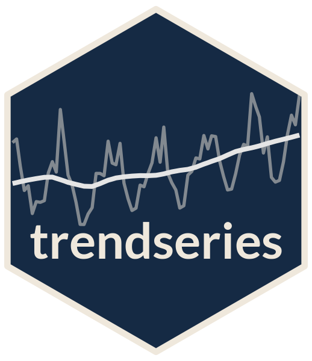
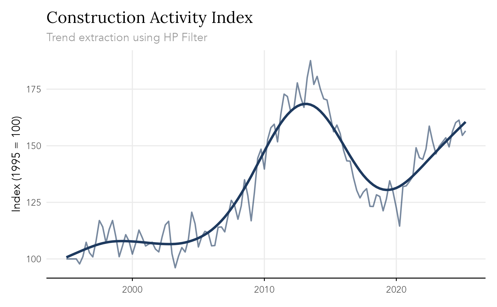

<!-- README.md is generated from README.Rmd. Please edit that file -->

```{r, include = FALSE}
knitr::opts_chunk$set(
  collapse = TRUE,
  comment = "#>",
  fig.path = "man/figures/README-",
  out.width = "100%",
  fig.align = "center",
  fig.width = 7,
  warning = FALSE,
  dev = "svg"
)
```

# trendseries: extract trends from time series 

<!-- badges: start -->
[](https://CRAN.R-project.org/package=trendseries)
[](https://viniciusoike.r-universe.dev/trendseries)
<!-- badges: end -->

`trendseries` provides a unified interface to extract trends, cycles, and seasonal components from time series. Most filtering methods in R are designed for `ts` objects, but datasets typically come in a `data.frame` format with a date column, which makes applying filters cumbersome. `trendseries` bridges this gap: `augment_trends()`, `decompose_series()`, `deseason_series()`, and `detrend_series()` all work directly on `data.frame`/`tibble` objects, while `extract_trends()` provides the same methods for `ts`/`xts`/`zoo` objects when you need to stay in native time-series format.

## Installation

`trendseries` is available on CRAN

```{r, eval = FALSE}
install.packages("trendseries")
```

You can install the newest version of trendseries from [R-Universe](https://viniciusoike.r-universe.dev/trendseries).

``` r
install.packages(
  'trendseries',
  repos = c(
    'https://viniciusoike.r-universe.dev',
    'https://cloud.r-project.org'
  )
)
```

## Core Functions

Six core functions cover `data.frame`/`tibble`/`data.table` workflows.

-   **`augment_trends()`**: adds trend columns to the original dataset.
-   **`augment_rolling()`**: add rolling window trend columns to the original dataset.
-   **`decompose_series()`**: splits a series into trend, seasonal, and remainder components.
-   **`deseason_series()`**: wraps `decompose_series()` to return a seasonally adjusted series.
-   **`detrend_series()`**: wraps `augment_trends()` to return the deviation from trend (the cycle).
-   **`index_series()`**: rescales one or more series to a common base period and value.

Some functions like `augment_trends()` also have a `ts`/`xts`/`zoo`-native counterpart via **`extract_trends()`**, for workflows that stay in native time-series format.

`augment_trends()` and `detrend_series()` also accept tsibbles with `Date`,
`yearmonth`, or `yearquarter` indices. They use the tsibble index and key as
defaults and return a tsibble. The **tsibble** package is optional.

## Usage

The example below computes three filters (HP, STL, and moving average) on a quarterly index of construction activity. `augment_trends()` detects the frequency of the data and picks conventional defaults for the HP filter.

```{r}
library(trendseries)
library(ggplot2)
data(gdp_construction)
# Computes multiple trends at once
series <- gdp_construction |>
  # Automatically detects frequency
  # Trends are added as new columns to the original dataset
  augment_trends(
    value_col = "index",
    methods = c("hp", "stl", "ma")
  )

series
```



An equivalent `extract_trends()` function is also available for `ts` objects.

```{r}
stl_trend <- extract_trends(AirPassengers, methods = "stl")
plot.ts(AirPassengers)
lines(stl_trend, col = "#C53030")
```

## Available Methods

The
[Trend Extraction Methods](https://viniciusoike.github.io/trendseries/articles/methods.html)
article describes each one: when to use it and which parameters it takes.

```{r methods-table, echo = FALSE}
info <- trendseries:::.method_info()
category_order <- c("econometric", "bandpass", "moving_average", "smoothing")
info <- info[order(match(info$category, category_order)), ]

knitr::kable(
  data.frame(
    Method = paste0("`", info$method, "`"),
    Description = info$description
  ),
  row.names = FALSE
)
```

## Learn More

To learn more about the package be sure to visit the [webiste](https://viniciusoike.github.io/trendseries/)

The vignettes below cover each function in detail.

-   [Introduction to trendseries](https://viniciusoike.github.io/trendseries/articles/trendseries.html)

-   [Augmenting Trends](https://viniciusoike.github.io/trendseries/articles/augment-trends.html)
-   [Decomposing Series](https://viniciusoike.github.io/trendseries/articles/decompose-series.html)
-   [Detrending Series](https://viniciusoike.github.io/trendseries/articles/detrend-series.html)

-   [Trend Extraction Methods](https://viniciusoike.github.io/trendseries/articles/methods.html)

-   [Moving Averages](https://viniciusoike.github.io/trendseries/articles/moving-averages.html)

-   [Econometric Filters](https://viniciusoike.github.io/trendseries/articles/econometric-filters.html)

## Included data and attribution

The package includes daily Arabica and Robusta coffee price indicators from
the Centro de Estudos Avançados em Economia Aplicada (CEPEA), Escola Superior
de Agricultura Luiz de Queiroz (ESALQ), Universidade de São Paulo (USP). See
the [Arabica](https://www.cepea.org.br/br/indicador/series/cafe.aspx?id=23) and
[Robusta](https://www.cepea.org.br/br/indicador/series/cafe.aspx?id=24) source
series, and the [Arabica methodology](https://www.cepea.org.br/br/metodologia/metodologia-cafe-arabica-cepea-esalq.aspx)
and [Robusta methodology](https://www.cepea.org.br/br/metodologia/metodologia-cafe-robusta-cepea-esalq.aspx).

CEPEA identifies its coffee data as available under the [Creative Commons
Attribution-NonCommercial 4.0 International license](https://creativecommons.org/licenses/by-nc/4.0/).
That license applies to the CEPEA-derived data; the package code is licensed
under MIT. The bundled data are an adapted version: `usd_2022` is calculated
from the source dollar price using U.S. inflation data, and `trend_ma` is a
22-observation moving-average column. The current bundled release contains
only missing values in `trend_ma`.

Suggested attribution:

> Centro de Estudos Avançados em Economia Aplicada (CEPEA), Escola Superior
> de Agricultura Luiz de Queiroz (ESALQ), Universidade de São Paulo (USP),
> [CEPEA/ESALQ coffee price indicators](https://www.cepea.org.br/br/indicador/cafe.aspx),
> [CC BY-NC 4.0](https://creativecommons.org/licenses/by-nc/4.0/); adapted in
> `trendseries`. This attribution does not imply CEPEA endorses the package.

## TfL Network Demand data

`trendseries` includes `transit_london_monthly` and `transit_london_avgs`,
which are derived from Transport for London's (TfL) daily **Journeys** files.
The source covers Bus and Tube journeys only; it is distinct from TfL's
station-footfall files. The bundled snapshot contains daily records from
2019-01-01 through 2025-12-27. TfL can revise historical rows when the source
files are refreshed, so these datasets should be treated as a versioned
snapshot rather than a live feed.

`transit_london_monthly` sums the reported daily journey counts by calendar
month. `transit_london_avgs` calculates the mean daily count by month, mode,
and UK business-day status. The counts are recorded ticketing activity, not an
absolute measure of passenger numbers or journeys made; they exclude people
who did not tap in or out and are approximate, rounded to the nearest thousand.

Source and methodology: [TfL Network demand data](https://tfl.gov.uk/corporate/publications-and-reports/network-demand-data), the [Network Demand Dashboard](https://app.powerbi.com/view?r=eyJrIjoiZDgwZWY4NWMtZTFkMi00YzM2LThiMWQtNzg2ZTc2YjliNzM2IiwidCI6IjFmYmQ2NWJmLTVkZWYtNGVlYS1hNjkyLWEwODljMjU1MzQ2YiIsImMiOjh9), and TfL's [Transport Data Service terms](https://tfl.gov.uk/corporate/terms-and-conditions/transport-data-service).

Required attribution:

> Powered by TfL Open Data

The package is not affiliated with or endorsed by TfL.

## ONS Retail Sales Index data

The package also includes a processed subset of the [ONS Retail Sales
Index](https://www.ons.gov.uk/businessindustryandtrade/retailindustry/datasets/retailsalesindexreferencetables),
specifically Table 3M's non-seasonally adjusted chained volume indices for
selected retail sectors in Great Britain. See the [ONS Retail Sales Index
methodology](https://www.ons.gov.uk/businessindustryandtrade/retailindustry/methodologies/retailsalesindexrsiqmi)
for details on coverage and methods. Contains public sector information
licensed under the [Open Government Licence
v3.0](https://www.nationalarchives.gov.uk/doc/open-government-licence/version/3/),
except where otherwise stated.
