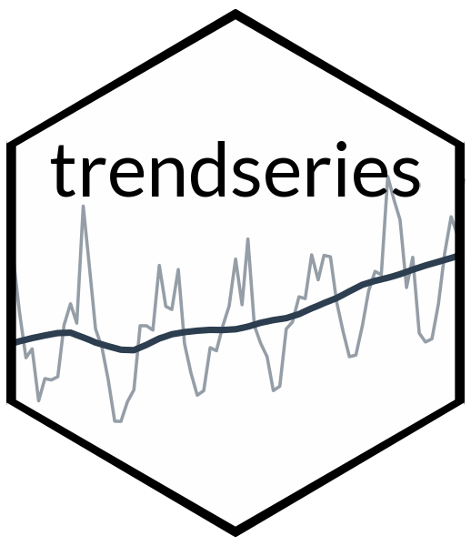
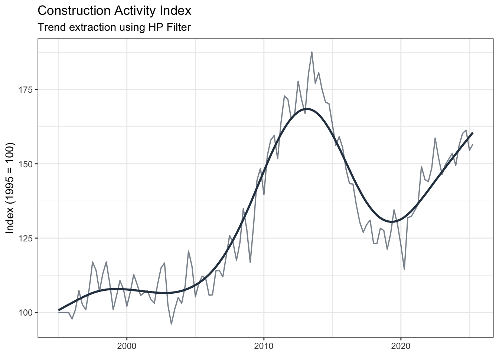
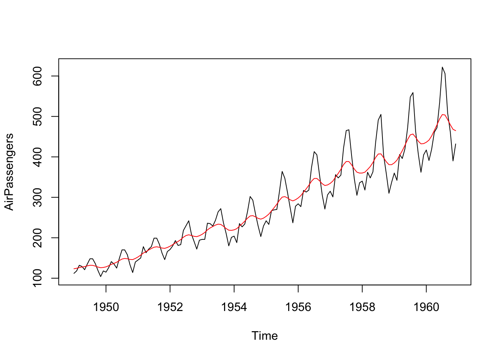

<!-- README.md is generated from README.Rmd. Please edit that file -->

# trendseries

<!-- badges: start -->


<!-- badges: end -->

The goal of `trendseries` is to provide a modern, pipe-friendly
interface for exploratory analysis of time series data in conventional
`data.frame` format.

## Installation

You can install the development version of trendseries from
[GitHub](https://github.com/) with:

``` r
# install.packages("pak")
pak::pak("viniciusoike/trendseries")
```

## Main Functions

The package provides two main functions:

- **`augment_trends()`**: adds trend columns to tibbles/data.frames
- **`extract_trends()`**: extracts trends from ts/xts/zoo objects

## Examples

Time series have a specific structure in R (`ts`) and most filtering
methods are designed for `ts` objects. However, datasets come as data
frames with date columns, which can make applying filters cumbersome.

The usual workflow involves (1) converting individual columns to `ts`,
(2) applying the filter, (3) and then converting back to a `data.frame`.
This can be cumbersome, especially when working with multiple series or
grouped data. Merging back the results with the original data can also
be error-prone due to misalignment of dates and additional `NA` values
introduced by some filters.

`trendseries` aims to make this process easier by keeping the data in a
`data.frame` format. The example below computes three filters (HP, STL,
and moving average) on a quarterly index of construction activity. Note
that the `augment_trends()` function automatically detects the frequency
of the data and uses conventional defaults for the HP filter.

``` r
library(trendseries)
library(ggplot2)
data("gdp_construction")
# Computes multiple trends at once
series <- gdp_construction |>
  # Automatically detects frequency
  augment_trends(
    value_col = "index",
    methods = c("hp", "stl", "ma")
    )
#> Auto-detected quarterly (4 obs/year)
#> Computing HP filter (two-sided) with lambda = 1600
#> Computing STL trend with s.window = periodic
#> Computing 2x4-period MA (auto-adjusted for even-window centering)
# Trends are added as new columns to the original dataset
series
#> # A tibble: 122 × 5
#>    date       index trend_hp trend_stl trend_ma
#>    <date>     <dbl>    <dbl>     <dbl>    <dbl>
#>  1 1995-01-01 100       101.     102.      NA  
#>  2 1995-04-01 100       101.     101.      99.7
#>  3 1995-07-01 100       102.     100.      99.6
#>  4 1995-10-01 100       103.      99.4    101. 
#>  5 1996-01-01  97.8     103.     101.     102. 
#>  6 1996-04-01 101.      104.     102.     103. 
#>  7 1996-07-01 107.      104.     103.     104. 
#>  8 1996-10-01 103.      105.     104.     106. 
#>  9 1997-01-01 101.      106.     106.     109. 
#> 10 1997-04-01 108.      106.     109.     111. 
#> # ℹ 112 more rows
```

``` r
ggplot(series, aes(date)) +
  geom_line(aes(y = index), color = "#2c3e50", lwd = 0.6, alpha = 0.6) +
  geom_line(aes(y = trend_hp), color = "#2c3e50", lwd = 1) +
  labs(
    title = "Construction Activity Index",
    subtitle = "Trend extraction using HP Filter",
    x = NULL,
    y = "Index (1995 = 100)") +
  theme_bw()
```



An equivalent `extract_trends()` function is also available for `ts`
objects.

``` r
loess <- extract_trends(AirPassengers, methods = "kalman")
#> Computing Kalman smoother with measurement noise = auto
plot.ts(AirPassengers)
lines(loess, col = "red")
```



## Available Methods

`trendseries` supports many trend estimation methods. The overall goal
is to support the most commonly used methods in econometrics and
statistics.

| Method     | Description                         |
|------------|-------------------------------------|
| `loess`    | Local polynomial regression         |
| `spline`   | Smoothing splines                   |
| `poly`     | Polynomial trends                   |
| `median`   | Median filter                       |
| `stl`      | Seasonal-trend decomposition        |
| `ma`       | Simple moving average               |
| `wma`      | Weighted moving average             |
| `ewma`     | Exponential weighted moving average |
| `kalman`   | Kalman filter/smoother              |
| `ucm`      | Unobserved components model         |
| `kernel`   | Kernel smoother                     |
| `hp`       | Hodrick-Prescott filter             |
| `hamilton` | Hamilton regression filter          |
| `bk`       | Baxter-King bandpass filter         |
| `bn`       | Beveridge-Nelson decomposition      |
| `cf`       | Christiano-Fitzgerald filter        |

## Learn More

See the vignettes for detailed examples and usage patterns: -
[Introduction to
trendseries](https://viniciusoike.github.io/trendseries/articles/trendseries.html) -
[Economic
Filters](https://viniciusoike.github.io/trendseries/articles/economic-filters.html) -
[Moving
Averages](https://viniciusoike.github.io/trendseries/articles/moving-averages.html)

## License

MIT + file LICENSE
