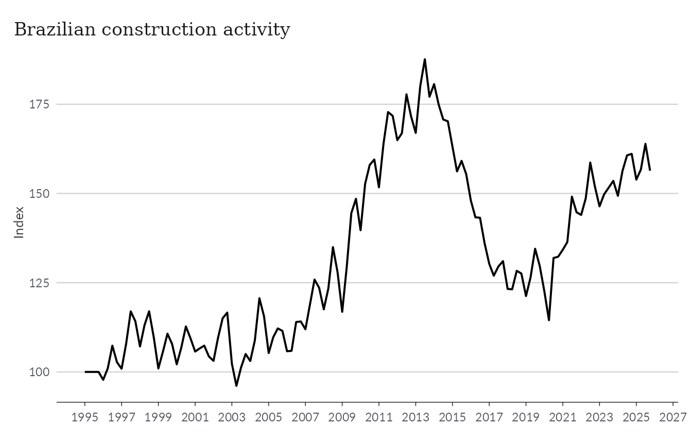
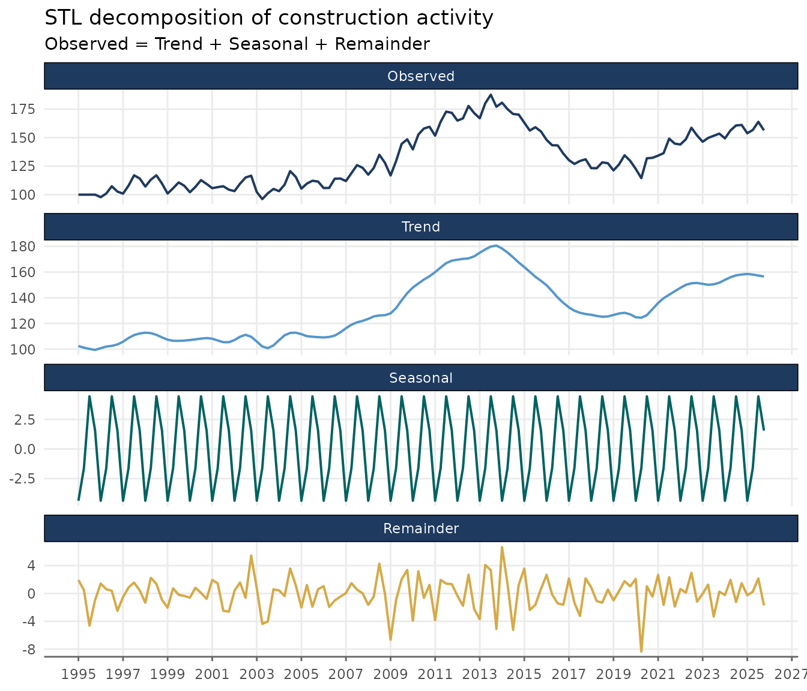
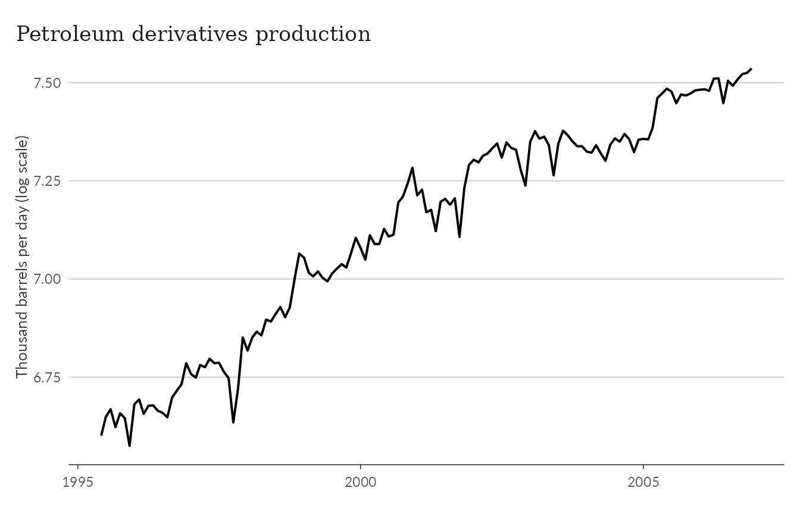
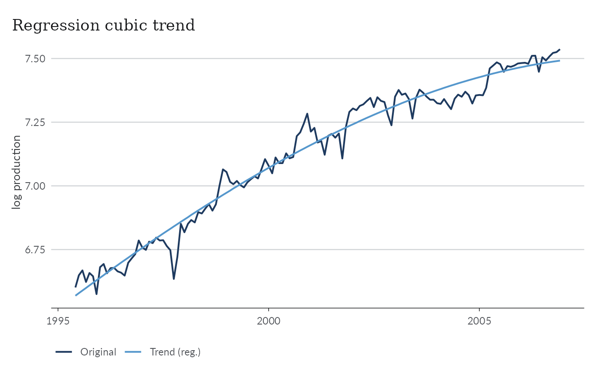
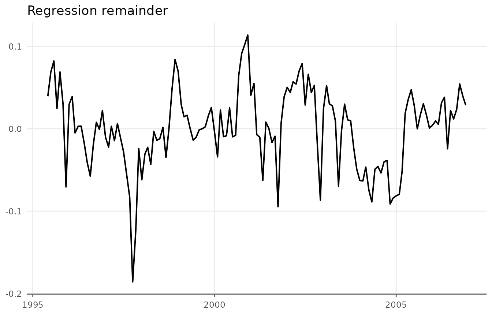
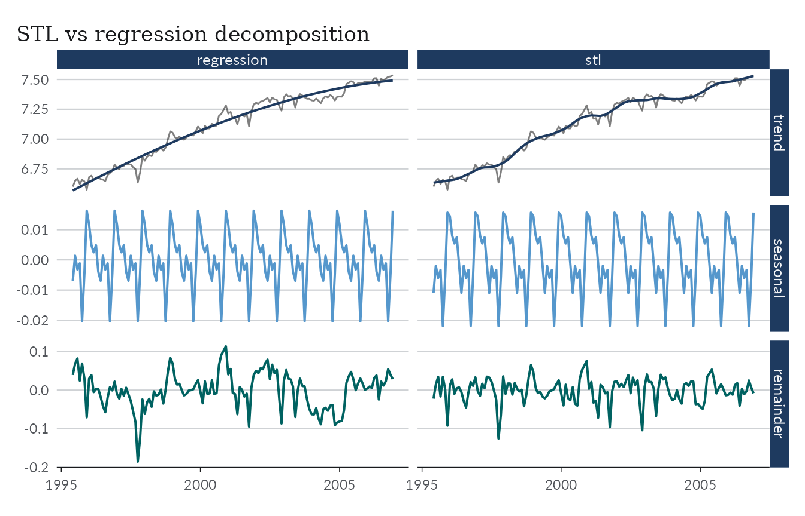
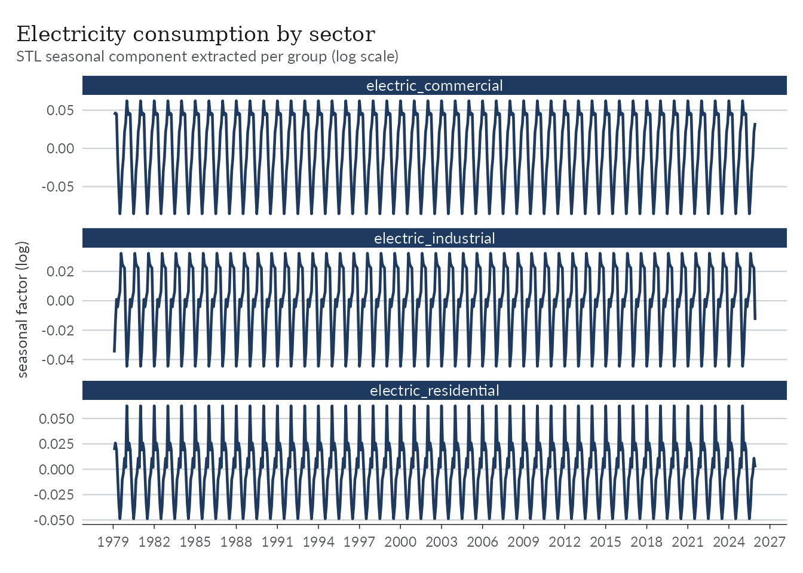
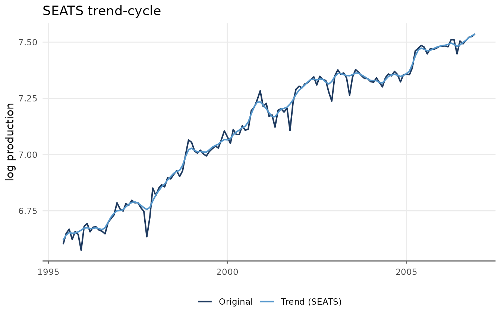
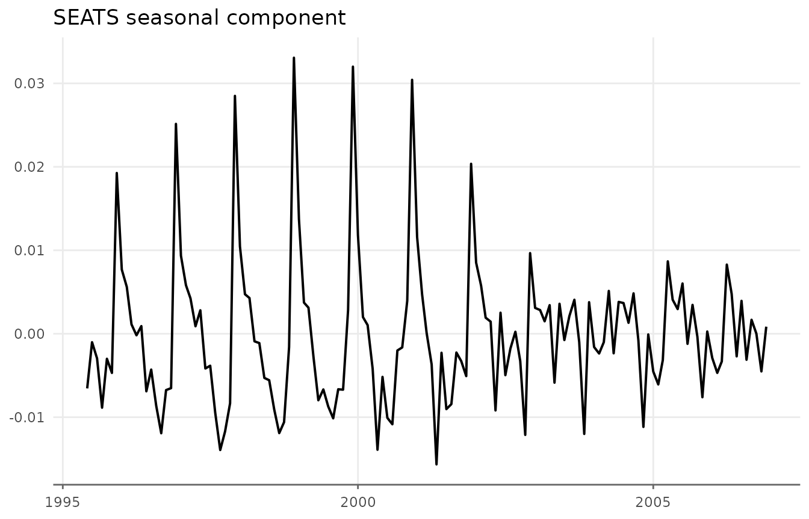
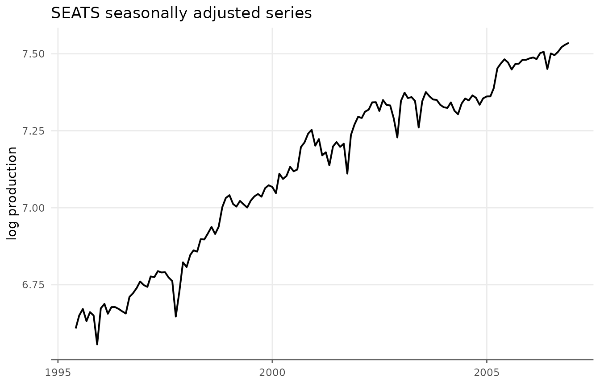

# Decomposing Series

## Decomposing Series

The trend extraction methods covered in the other vignettes return a
single smooth component. Often, though, an economic series is more
naturally described as the sum of three parts: a slow-moving **trend**,
a repeating **seasonal** pattern, and an irregular **remainder**.
[`decompose_series()`](https://viniciusoike.github.io/trendseries/reference/decompose_series.md)
splits a series into these three components and adds them as columns to
the original data frame.

``` r

library(trendseries)
library(dplyr)
library(tidyr)
```

The theme below is used throughout the vignette for consistent styling.

``` r

library(ggplot2)

theme_series <- theme_minimal(paper = "#fefefe") +
  theme(
    legend.position = "bottom",
    panel.grid.minor = element_blank(),
    strip.background = element_rect(fill = "#2c3e50"),
    strip.text = element_text(color = "#fefefe"),
    axis.ticks.x = element_line(color = "gray40", linewidth = 0.5),
    axis.line.x = element_line(color = "gray40", linewidth = 0.5),
    axis.title.x = element_blank(),
    palette.colour.discrete = c(
      "#2c3e50",
      "#e74c3c",
      "#f39c12",
      "#1abc9c",
      "#9b59b6"
    )
  )
```

### Trend extraction vs decomposition

- [`augment_trends()`](https://viniciusoike.github.io/trendseries/reference/augment_trends.md)
  returns **only the trend** (`trend_*` columns). The seasonal and
  irregular movements are smoothed away.
- [`decompose_series()`](https://viniciusoike.github.io/trendseries/reference/decompose_series.md)
  returns the **trend**, **seasonal**, and **remainder** components
  (`trend_*`, `seasonal_*`, and `remainder_*`), which should add back up
  to the original series.

Because there is a seasonal component,
[`decompose_series()`](https://viniciusoike.github.io/trendseries/reference/decompose_series.md)
requires seasonal data: monthly (`frequency = 12`) or quarterly
(`frequency = 4`). For annual series there is nothing seasonal to
isolate, so use
[`augment_trends()`](https://viniciusoike.github.io/trendseries/reference/augment_trends.md)
instead.

### A first decomposition

Let’s start with the `gdp_construction` dataset, a quarterly index of
Brazilian construction activity that ships with `trendseries`.

``` r

ggplot(gdp_construction, aes(date, index)) +
  geom_line(lwd = 0.7) +
  scale_x_date(date_breaks = "2 years", date_labels = "%Y") +
  labs(
    title = "Brazilian construction activity",
    y = "Index"
  ) +
  theme_series
```



Passing the data to
[`decompose_series()`](https://viniciusoike.github.io/trendseries/reference/decompose_series.md)
adds three new columns. The frequency is detected automatically from the
date column.

``` r

gdp_parts <- gdp_construction |>
  decompose_series(value_col = "index")

gdp_parts
#> # A tibble: 124 × 5
#>    date       index trend_stl seasonal_stl remainder_stl
#>    <date>     <dbl>     <dbl>        <dbl>         <dbl>
#>  1 1995-01-01 100       102.         -4.37         1.93 
#>  2 1995-04-01 100       101.         -1.62         0.476
#>  3 1995-07-01 100       100.          4.44        -4.62 
#>  4 1995-10-01 100        99.4         1.55        -0.946
#>  5 1996-01-01  97.8     101.         -4.37         1.42 
#>  6 1996-04-01 101.      102.         -1.62         0.613
#>  7 1996-07-01 107.      103.          4.44         0.370
#>  8 1996-10-01 103.      104.          1.55        -2.49 
#>  9 1997-01-01 101.      106.         -4.37        -0.530
#> 10 1997-04-01 108.      109.         -1.62         0.849
#> # ℹ 114 more rows
```

The three components are named after the method (`stl` by default):
`trend_stl`, `seasonal_stl`, and `remainder_stl`.

Reshaping to long format makes it easy to plot the original series
alongside its three components.

``` r

gdp_long <- gdp_parts |>
  pivot_longer(
    cols = c(index, trend_stl, seasonal_stl, remainder_stl),
    names_to = "component",
    values_to = "value"
  ) |>
  mutate(
    component = factor(
      component,
      levels = c("index", "trend_stl", "seasonal_stl", "remainder_stl"),
      labels = c("Observed", "Trend", "Seasonal", "Remainder")
    )
  )
```

``` r

ggplot(gdp_long, aes(date, value)) +
  geom_line(aes(color = component), lwd = 0.7, show.legend = FALSE) +
  facet_wrap(vars(component), ncol = 1, scales = "free_y") +
  scale_x_date(date_breaks = "2 years", date_labels = "%Y") +
  labs(
    title = "STL decomposition of construction activity",
    subtitle = "Observed = Trend + Seasonal + Remainder",
    y = NULL
  ) +
  theme_series
```



### STL decomposition

The default method is **STL** (Seasonal-Trend decomposition via Loess),
implemented with [`stats::stl()`](https://rdrr.io/r/stats/stl.html). The
seasonal component is estimated with a loess smoother, the trend with an
adaptive moving average, and the remainder is whatever is left over. The
defaults (`s.window = "periodic"`, `robust = FALSE`) assume a stable
seasonal pattern.

The `params` list gives finer control. Two common adjustments are an
evolving seasonal pattern and robust fitting.

``` r

# Allow the seasonal pattern to evolve slowly over time, and downweight outliers
gdp_robust <- gdp_construction |>
  decompose_series(
    value_col = "index",
    params = list(s.window = 13, robust = TRUE)
  )
```

A `s.window` of `"periodic"` forces an identical seasonal shape in every
year; supplying a positive odd integer instead lets that shape drift
gradually. Setting `robust = TRUE` reduces the influence of one-off
spikes on the trend and seasonal estimates.

### Regression decomposition

The **regression** method (`methods = "regression"`) fits a single OLS
model

``` math
y_t = f(t) + s(t) + \epsilon_t
```

where $`f(t)`$ is a polynomial in time and $`s(t)`$ is a set of period
(month or quarter) dummy variables. The trend is the constant plus the
polynomial terms, the seasonal component is the period effect (centred
to mean zero), and the remainder is the model residual.

Unlike STL, the regression trend is a smooth global polynomial, which
can be a better description of a series with a steady long-run
direction. For the examples that follow we use the `oil_derivatives`
dataset, which records monthly petroleum-derivatives production in
Brazil; we restrict it to the 1995–2006 window and work on the log
scale.

``` r

suboil <- oil_derivatives |>
  filter(between(date, as.Date("1995-06-01"), as.Date("2006-12-01"))) |>
  mutate(lprod = log(production))

ggplot(suboil, aes(date, lprod)) +
  geom_line(lwd = 0.7) +
  labs(
    title = "Petroleum derivatives production",
    y = "Thousand barrels per day (log scale)"
  ) +
  theme_series
```



The `trend` argument selects the polynomial form: `"linear"` (the
default), `"quadratic"`, or `"cubic"`. Orthogonal polynomials are used
by default for numerical stability.

``` r

suboil_reg <- suboil |>
  decompose_series(
    value_col = "lprod",
    methods = "regression",
    trend = "cubic"
  )

ggplot(suboil_reg, aes(date)) +
  geom_line(aes(y = lprod, color = "Original"), lwd = 0.7) +
  geom_line(aes(y = trend_regression, color = "Trend (reg.)"), lwd = 0.7) +
  labs(title = "Regression cubic trend", y = "log production", color = NULL) +
  theme_series
```



If the series is trend-stationary, `remainder_regression` — the series
with the trend and seasonality removed — is approximately stationary.

``` r

ggplot(suboil_reg, aes(date, remainder_regression)) +
  geom_line(lwd = 0.7) +
  labs(title = "Regression remainder", y = NULL) +
  theme_series
```



Comparing the two methods directly, both produce fixed seasonal
patterns, but STL follows short-term fluctuations more closely,
producing a “cleaner” remainder.

``` r

comparison <- suboil |>
  decompose_series(value_col = "lprod", methods = "stl") |>
  decompose_series(value_col = "lprod", methods = "regression", trend = "cubic")

comparison_long <- comparison |>
  pivot_longer(
    cols = trend_stl:remainder_regression,
    names_pattern = "(.*)_(.*)",
    names_to = c("component", "method"),
    values_to = "trend"
  ) |>
  mutate(
    component = factor(component, levels = c("trend", "seasonal", "remainder"))
  )

ggplot(comparison_long, aes(date, trend)) +
  # Original series
  geom_line(
    data = suboil,
    aes(y = lprod),
    layout = c(1, 2),
    lwd = 0.5,
    alpha = 0.5
  ) +
  # Components and methods
  geom_line(aes(y = trend, color = component), lwd = 0.7) +
  facet_grid(vars(component), vars(method), scales = "free_y") +
  guides(color = "none") +
  labs(title = "STL vs regression decomposition", y = NULL) +
  theme_series
```



### Grouped decomposition

Like
[`augment_trends()`](https://viniciusoike.github.io/trendseries/reference/augment_trends.md),
[`decompose_series()`](https://viniciusoike.github.io/trendseries/reference/decompose_series.md)
accepts a `group_cols` argument to decompose several series at once. The
data must be in tidy format. Here we use the `electricity` dataset,
which records monthly electricity consumption for three sectors
(residential, commercial, and industrial).

``` r

electricity_parts <- electricity |>
  mutate(lvalue = log(value)) |>
  decompose_series(value_col = "lvalue", group_cols = "name_series")

glimpse(electricity_parts)
#> Rows: 1,689
#> Columns: 7
#> $ date          <date> 1979-02-01, 1979-03-01, 1979-04-01, 1979-05-01, 1979-06…
#> $ name_series   <chr> "electric_commercial", "electric_commercial", "electric_…
#> $ value         <dbl> 1030, 1057, 1044, 1038, 1002, 979, 985, 1047, 1067, 1113…
#> $ lvalue        <dbl> 6.937314, 6.963190, 6.950815, 6.945051, 6.909753, 6.8865…
#> $ trend_stl     <dbl> 6.908726, 6.918239, 6.927753, 6.937020, 6.946288, 6.9554…
#> $ seasonal_stl  <dbl> 0.04401996, 0.04635439, 0.04502582, -0.01022254, -0.0527…
#> $ remainder_stl <dbl> -0.015431723, -0.001403624, -0.021963659, 0.018253335, 0…
```

Each group is decomposed independently, and the components are stacked
back into a single data frame.

``` r

ggplot(electricity_parts, aes(date)) +
  geom_line(aes(y = seasonal_stl), color = "#2c3e50", lwd = 0.8) +
  facet_wrap(vars(name_series), ncol = 1, scales = "free_y") +
  scale_x_date(date_breaks = "3 years", date_labels = "%Y") +
  labs(
    title = "Electricity consumption by sector",
    subtitle = "STL seasonal component extracted per group (log scale)",
    y = "seasonal factor (log)"
  ) +
  theme_series
```



### Multiplicative seasonality

So far we have handled multiplicative seasonality by logging the series
before decomposing (`lprod = log(production)`, `lvalue = log(value)`).
Many macroeconomic series behave this way: the seasonal variations grow
with the level of the series, so an additive decomposition of the raw
data would leave a seasonal pattern that widens over time.

Every
[`decompose_series()`](https://viniciusoike.github.io/trendseries/reference/decompose_series.md)
method is additive by construction. Instead of logging manually, you can
pass `transform = "log"`, which logs the series, decomposes it
additively, and exponentiates the components back to the original scale.

``` r

decompose_series(
  oil_derivatives,
  value_col = "production",
  transform = "log"
)
```

The decomposition is additive on the log scale, so after exponentiating
the components multiply back to the series:
`trend * seasonal * remainder = value`. This requires strictly positive
data.

### Other methods

#### Classical decomposition

`methods = "classic"` is the textbook decomposition implemented by
[`stats::decompose()`](https://rdrr.io/r/stats/decompose.html). The
trend is a centred moving average of order equal to the frequency, the
seasonal component is the average detrended value for each period, and
the remainder is what is left. It is simple and fast, but the other
methods handle evolving seasonality and the endpoints better.

``` r

decompose_series(
  oil_derivatives,
  value_col = "production",
  methods = "classic",
  transform = "log"
)
```

#### Basic structural model

`methods = "bsm"` fits a Basic Structural (state-space) Model with
[`stats::StructTS()`](https://rdrr.io/r/stats/StructTS.html): stochastic
level, slope, and seasonal components estimated by maximum likelihood
and extracted with the Kalman smoother. Unlike the moving-average
methods, it returns trend and seasonal estimates for *every* observation
and lets both components evolve over time. The trade-off is that it
relies on numerical optimisation, which can occasionally fail to
converge on short or irregular series.

``` r

decompose_series(
  suboil,
  value_col = "lprod",
  methods = "bsm"
)
```

#### X-13ARIMA-SEATS (`seasonal`)

`methods = "seats"` runs the U.S. Census Bureau’s X-13ARIMA-SEATS
program through the `seasonal` package — the seasonal-adjustment
procedure used by many statistical agencies. `seas()` is called with its
automatic defaults: ARIMA model selection, log/level transformation,
outlier detection, and calendar adjustment.

The SEATS trend-cycle and seasonally adjusted series are then mapped to
an additive trend/seasonal/remainder triple. Because X-13 selects its
own transformation internally, there is normally no need to set
`transform = "log"` for this method. This method requires the `seasonal`
package to be installed.

``` r

# requires the 'seasonal' package
seas_oil <- decompose_series(
  suboil,
  value_col = "lprod",
  methods = "seats"
)

ggplot(seas_oil, aes(date)) +
  geom_line(aes(y = lprod, color = "Original"), lwd = 0.7) +
  geom_line(aes(y = trend_seats, color = "Trend (SEATS)"), lwd = 0.7) +
  labs(title = "SEATS trend-cycle", y = "log production", color = NULL) +
  theme_series
```



``` r

ggplot(seas_oil, aes(date, seasonal_seats)) +
  geom_line(lwd = 0.7) +
  labs(title = "SEATS seasonal component", y = NULL) +
  theme_series
```



Often our interest is mainly in the series *without* its seasonal
component. For convenience,
[`deseason_series()`](https://viniciusoike.github.io/trendseries/reference/deseason_series.md)
wraps
[`decompose_series()`](https://viniciusoike.github.io/trendseries/reference/decompose_series.md)
and returns the seasonally adjusted series directly.

``` r

deseas_oil <- deseason_series(
  suboil,
  value_col = "lprod",
  methods = "seats",
  # set to TRUE to also return the trend, seasonal, and remainder components
  components = FALSE
)

ggplot(deseas_oil, aes(date, seasadj_seats)) +
  geom_line(lwd = 0.7) +
  labs(
    title = "SEATS seasonally adjusted series",
    y = "log production"
  ) +
  theme_series
```



This is equivalent to using `seasadj = TRUE` in
[`decompose_series()`](https://viniciusoike.github.io/trendseries/reference/decompose_series.md).

``` r

decompose_series(
  suboil,
  value_col = "lprod",
  methods = "seats",
  seasadj = TRUE
)
```

### Summary

- [`decompose_series()`](https://viniciusoike.github.io/trendseries/reference/decompose_series.md)
  splits a seasonal (monthly or quarterly) series into trend, seasonal,
  and remainder components, which should sum back to the original
  series.
- The methods available are `"stl"` (default), `"regression"`,
  `"classic"`, `"bsm"`, and `"seats"`.
- All methods are additive; use `transform = "log"` for multiplicative
  seasonality, where the components instead multiply back to the series.
- [`deseason_series()`](https://viniciusoike.github.io/trendseries/reference/deseason_series.md)
  is a convenience wrapper that returns only the seasonally adjusted
  series.
