# Econometric Filters: Henderson, Bandpass, HP, and Hamilton

This vignette covers six econometric filters available in `trendseries`:
the **Henderson** and **Spencer** moving averages, the **Baxter-King**
and **Christiano-Fitzgerald** bandpass filters, and the
**Hodrick-Prescott** and **Hamilton** filters. All six are widely used
in macroeconomics and official statistics for extracting trends and
isolating business cycles.

``` r

library(trendseries)
library(dplyr)
library(tidyr)
```

The theme below is used throughout the vignette for consistent styling.

``` r

library(ggplot2)

theme_series <- theme_minimal(paper = "#fefefe") +
  theme(
    legend.position = "bottom",
    panel.grid.minor = element_blank(),
    strip.background = element_rect(fill = "#2c3e50"),
    strip.text = element_text(color = "#fefefe"),
    axis.ticks.x = element_line(color = "gray40", linewidth = 0.5),
    axis.line.x = element_line(color = "gray40", linewidth = 0.5),
    palette.colour.discrete = c(
      "#2c3e50",
      "#e74c3c",
      "#f39c12",
      "#1abc9c",
      "#9b59b6"
    )
  )
```

## Henderson and Spencer Moving Averages

### The Henderson Filter

The Henderson filter is the trend estimator used inside every major
official seasonal adjustment program: X-11, X-13ARIMA-SEATS (US Census
Bureau), and Statistics Canada’s X-12-ARIMA. Originally proposed by
Robert Henderson (1916) to smooth actuarial mortality tables, it became
the standard for national accounts trend extraction because it satisfies
two properties simultaneously:

1.  **Cubic polynomial reproduction.** The filter passes polynomials up
    to degree 3 through exactly — a cubic trend is returned unchanged.
    This means the filter does not distort smooth, polynomial-like
    economic trajectories.
2.  **Minimum roughness.** Among all symmetric filters that reproduce
    cubic polynomials, the Henderson weights minimise the sum of squared
    **third differences** of the smoothed series,
    $`\sum_t (\Delta^3 \hat{\tau}_t)^2`$. Minimising third differences
    is equivalent to finding the “most gradually changing” trend
    consistent with the cubic-reproduction constraint.

#### The weights

For a filter of length $`n = 2m + 1`$, the unnormalized weights are

``` math
w_j \propto \bigl[(m+1)^2-j^2\bigr]\bigl[(m+2)^2-j^2\bigr]\bigl[(m+3)^2-j^2\bigr]
  \cdot (\eta - j^2), \quad j = -m, \ldots, m
```

where $`\eta`$ is determined by setting $`\sum_j j^2 w_j = 0`$, which
enforces cubic polynomial reproduction. The weights are then normalized
to sum to one.

A distinguishing feature is that the weights take **small negative
values at the outermost positions**. Rather than amplifying peaks and
troughs, the filter slightly downweights the extreme observations
relative to the center. This property gives the Henderson trend its
characteristic stability at turning points.

``` r

# Compute 13-term Henderson weights from the closed-form formula
n <- 13L
m <- (n - 1L) / 2L
j <- seq_len(n) - (m + 1L)

P <- ((m + 1L)^2L - j^2L) *
     ((m + 2L)^2L - j^2L) *
     ((m + 3L)^2L - j^2L)

eta    <- sum(j^4L * P) / sum(j^2L * P)
w      <- P * (eta - j^2L)
w      <- w / sum(w)

weights_df <- data.frame(lag = j, weight = w)

ggplot(weights_df, aes(lag, weight)) +
  geom_col(aes(fill = weight > 0), width = 0.65, show.legend = FALSE) +
  geom_hline(yintercept = 0, color = "gray40", linewidth = 0.4) +
  scale_fill_manual(values = c("FALSE" = "#e74c3c", "TRUE" = "#2c3e50")) +
  scale_x_continuous(breaks = seq(-6, 6)) +
  labs(
    title    = "13-term Henderson Filter: Weight Profile",
    subtitle = "Weights sum to 1; small negative values at the outer lags stabilise turning points",
    x = "Lag (j)", y = "Weight"
  ) +
  theme_series
```

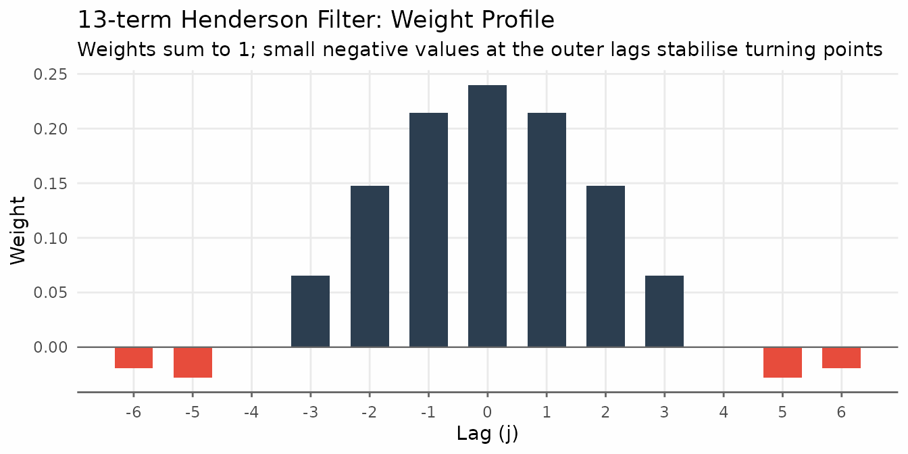

#### Basic usage

`trendseries` defaults to a 9-term filter for quarterly data and 13-term
for monthly data. Pass the data frame directly to
[`augment_trends()`](https://viniciusoike.github.io/trendseries/reference/augment_trends.md);
the trend is added as a new column.

``` r

# Default: 13-term for monthly data
ibcbr_hend <- augment_trends(ibcbr, value_col = "index", methods = "henderson")

head(ibcbr_hend)
#> # A tibble: 6 × 3
#>   date       index trend_henderson
#>   <date>     <dbl>           <dbl>
#> 1 2003-01-01  67.1              NA
#> 2 2003-02-01  68.8              NA
#> 3 2003-03-01  72.2              NA
#> 4 2003-04-01  71.3              NA
#> 5 2003-05-01  70.0              NA
#> 6 2003-06-01  68.8              NA
```

``` r

ggplot(ibcbr_hend, aes(date)) +
  geom_line(aes(y = index, color = "Original"), linewidth = 0.6, alpha = 0.7) +
  geom_line(aes(y = trend_henderson, color = "Trend: 13-term Henderson"),
            linewidth = 0.9) +
  scale_x_date(date_breaks = "3 years", date_labels = "%Y") +
  labs(
    title  = "IBC-Br: 13-term Henderson Moving Average",
    x = NULL, y = "Index", color = NULL
  ) +
  theme_series
```

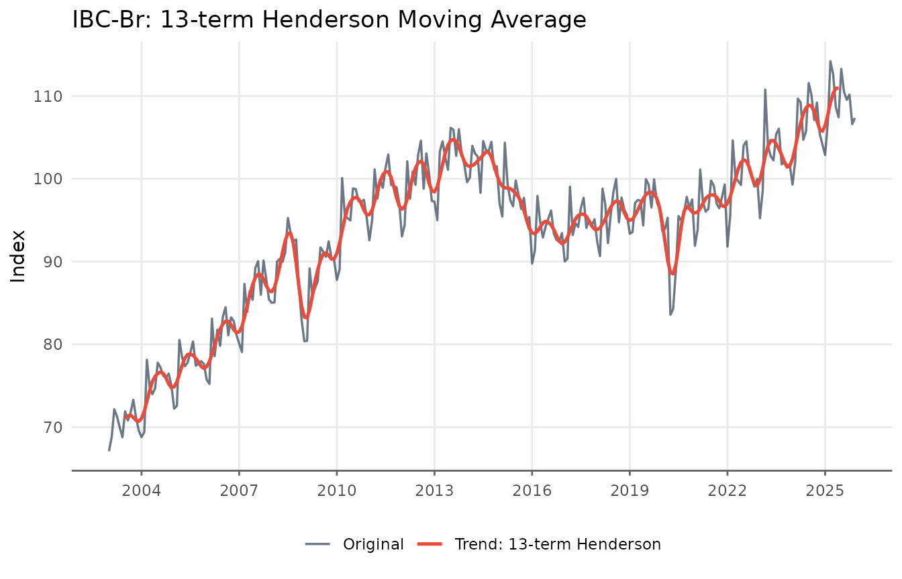

#### Choosing the window

The three standard lengths reflect the trade-off between smoothness and
endpoint coverage:

- **9-term** — the standard for quarterly data; suppresses cycles
  shorter than four quarters.
- **13-term** — the default for monthly data in X-11 and in
  `trendseries`. Loses six observations at each end of the sample.
- **23-term** — for monthly series with high irregularity (sharp spikes,
  volatile revisions). Loses eleven observations at each end.

X-13ARIMA-SEATS selects among these three lengths automatically using
the **irregularity-to-cycle (I/C) ratio**, a signal-to-noise measure
computed from the series. In practice, 13-term is the right starting
point for most monthly indicators.

Passing a vector to `window` runs all lengths in a single call and
returns one column per window, named `trend_henderson_{n}`.

``` r

ibcbr_windows <- ibcbr |>
  filter(date >= as.Date("2015-01-01")) |>
  augment_trends(
    value_col = "index",
    methods = "henderson",
    window = c(9, 13, 23),
    .quiet = TRUE
  )
```

``` r

ibcbr_windows_long <- ibcbr_windows |>
  pivot_longer(
    cols = starts_with("trend_henderson_"),
    names_to = "window",
    values_to = "trend"
  ) |>
  mutate(
    window = factor(
      window,
      levels = c(
        "trend_henderson_9",
        "trend_henderson_13",
        "trend_henderson_23"
      ),
      labels = c("9-term", "13-term", "23-term")
    )
  )

ggplot(ibcbr_windows_long, aes(date, trend)) +
  geom_line(
    data = ibcbr_windows,
    aes(y = index),
    color = "#2c3e50",
    alpha = 0.5,
    linewidth = 0.5
  ) +
  geom_line(color = "#e74c3c", linewidth = 0.9, na.rm = TRUE) +
  facet_wrap(vars(window), ncol = 1) +
  scale_x_date(date_breaks = "2 years", date_labels = "%Y") +
  labs(
    title = "Henderson Filter: Effect of Window Size",
    subtitle = "Gray = original series; larger windows are smoother but lose more data at the endpoints",
    x = NULL,
    y = "Index"
  ) +
  theme_series
```

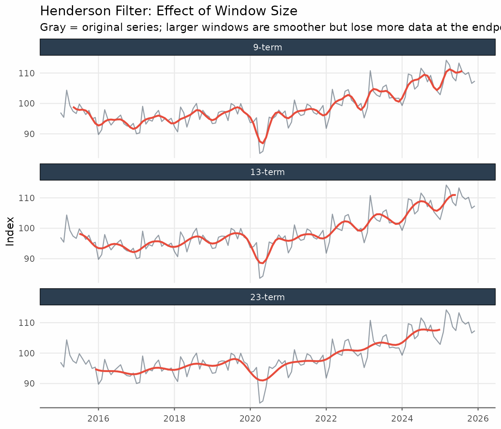

> **When to use the Henderson filter:** It is the natural choice when
> matching the methodology of official seasonal adjustment software
> (X-11, X-13, TRAMO-SEATS), or when you need a symmetric filter that
> exactly preserves polynomial trends up to degree 3. For monthly data,
> 13-term is the right default; switch to 23-term only if the series has
> sharp irregular spikes. For quarterly data, use 9-term.
>
> **When to be cautious:** Like all symmetric filters, Henderson loses
> $`\lfloor n/2 \rfloor`$ observations at each end — 6 months for the
> 13-term, 11 months for the 23-term. If end-of-sample estimates matter
> (nowcasting, near real-time monitoring), the one-sided HP filter or
> the Hamilton filter are more appropriate choices.

### The Spencer Moving Average

The Spencer 15-term moving average is the classical predecessor of the
Henderson filter, originally designed for smoothing mortality tables. It
uses fixed weights — no tuning parameters — and passes polynomials up to
degree 3, just like the Henderson filter. Because `trendseries` applies
linear extrapolation at the endpoints, the Spencer filter returns a
trend for every observation.

``` r

ibcbr_sp <- augment_trends(ibcbr, value_col = "index", methods = "spencer")

ibcbr_sp_recent <- ibcbr_sp |>
  filter(date >= as.Date("2015-01-01"))
```

``` r

ggplot(ibcbr_sp_recent, aes(date)) +
  geom_line(aes(y = index, color = "Original"), linewidth = 0.6, alpha = 0.7) +
  geom_line(aes(y = trend_spencer, color = "Trend: Spencer 15-term"),
            linewidth = 0.9) +
  scale_x_date(date_breaks = "2 years", date_labels = "%Y") +
  labs(
    title = "IBC-Br: Spencer 15-term Moving Average",
    x = NULL, y = "Index", color = NULL
  ) +
  theme_series
```

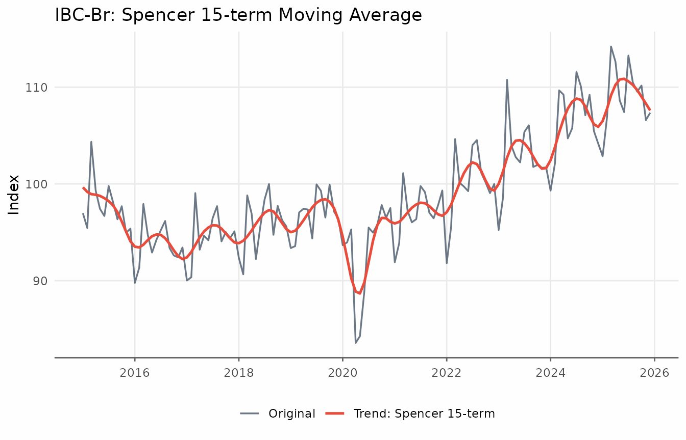

Comparing Henderson and Spencer on the same chart reveals that the two
filters are very similar. The main practical advantage of the Henderson
filter is that its length can be chosen to match the irregularity of the
series. The `augment_trends` function accepts multiple methods and
returns a column for each method.

``` r

ibcbr_hs <- ibcbr |>
  augment_trends(
    value_col = "index",
    methods = c("henderson", "spencer"),
    .quiet = TRUE
  )
```

``` r

ibcbr_hs_long <- ibcbr_hs |>
  filter(date >= as.Date("2015-01-01")) |>
  pivot_longer(
    cols = c(trend_henderson, trend_spencer),
    names_to = "filter",
    values_to = "trend"
  ) |>
  mutate(
    filter = recode(
      filter,
      trend_henderson = "Henderson (13-term)",
      trend_spencer = "Spencer (15-term)"
    )
  )

ggplot(ibcbr_hs_long, aes(date, trend)) +
  geom_line(
    aes(y = index),
    color = "gray70",
    linewidth = 0.5
  ) +
  geom_line(color = "#2c3e50", linewidth = 0.9, na.rm = TRUE) +
  facet_wrap(vars(filter), ncol = 2) +
  scale_x_date(date_breaks = "1 year", date_labels = "%Y") +
  labs(
    title = "Henderson vs. Spencer",
    subtitle = "Gray = original series; both filters produce very similar trends",
    x = NULL,
    y = "Index"
  ) +
  theme_series
```

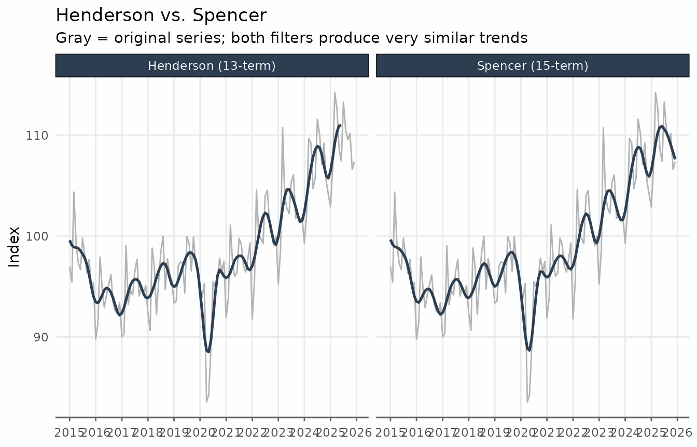

------------------------------------------------------------------------

## Bandpass Filters: Baxter-King and Christiano-Fitzgerald

Bandpass filters are designed to **isolate oscillations within a
specific frequency range**. In macroeconomics the goal is usually to
isolate the *business cycle*: fluctuations with periods between roughly
1.5 and 8 years (6 to 32 quarters). The trend returned by these filters
is the series with those frequencies removed: a very smooth, long-run
path.

Both the **Baxter-King (BK)** and **Christiano-Fitzgerald (CF)** filters
share the same economic interpretation: they pass only components with
periods outside the $`[p_l, p_u]`$ band and suppress everything within
that band.

We use the quarterly GDP construction index (Brazil) to illustrate these
filters, since quarterly data maps naturally onto the standard 6–32
quarter business cycle definition.

``` r

ggplot(gdp_construction, aes(date, index)) +
  geom_line(linewidth = 0.7, color = "#2c3e50") +
  scale_x_date(date_breaks = "5 years", date_labels = "%Y") +
  labs(
    title = "GDP – Construction (Brazil)",
    subtitle = "Chained index, quarterly",
    x = NULL,
    y = "Index"
  ) +
  theme_series
```

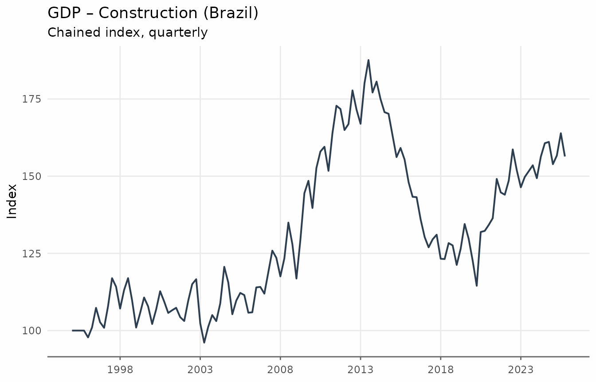

### Baxter-King Filter

The BK filter approximates the ideal bandpass filter with a **symmetric
moving average**. Its weights are chosen to minimise the distance
between the approximating filter and the ideal (brick-wall) bandpass
filter in the frequency domain. The key parameters are:

- `band = c(pl, pu)`: lower and upper period bounds (in quarters by
  default). The default `c(6, 32)` targets cycles of 1.5 to 8 years —
  the standard macroeconomic business cycle definition.

Because the BK filter is symmetric, it introduces
$`\lfloor \mathrm{pu}/2
\rfloor`$ missing values at each end of the series.

``` r

gdp_bk <- augment_trends(
  gdp_construction,
  date_col = "date",
  value_col = "index",
  methods = "bk"
)

head(gdp_bk)
#> # A tibble: 6 × 3
#>   date       index trend_bk
#>   <date>     <dbl>    <dbl>
#> 1 1995-01-01 100         NA
#> 2 1995-04-01 100         NA
#> 3 1995-07-01 100         NA
#> 4 1995-10-01 100         NA
#> 5 1996-01-01  97.8       NA
#> 6 1996-04-01 101.        NA
```

``` r

ggplot(gdp_bk, aes(date)) +
  geom_line(aes(y = index, color = "Original"), linewidth = 0.6, alpha = 0.7) +
  geom_line(
    aes(y = trend_bk, color = "Trend: Baxter-King"),
    linewidth = 0.9,
    na.rm = TRUE
  ) +
  scale_x_date(date_breaks = "5 years", date_labels = "%Y") +
  labs(
    title = "GDP Construction: Baxter-King Filter",
    subtitle = "Trend after removing business-cycle frequencies (6–32 quarters)",
    x = NULL,
    y = "Index",
    color = NULL
  ) +
  theme_series
```

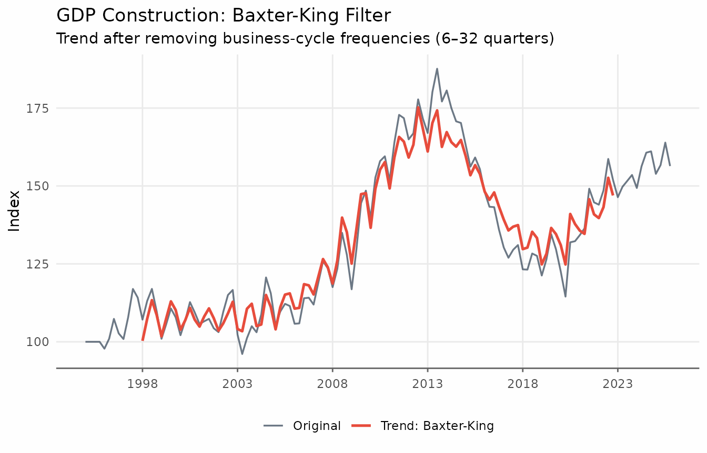

It is often more informative to look at the **cyclical component**: the
deviations of the series from its long-run trend.

``` r

gdp_cycle_bk <- gdp_bk |>
  mutate(cycle = index - trend_bk) |>
  filter(!is.na(cycle))
```

``` r

ggplot(gdp_cycle_bk, aes(date, cycle)) +
  geom_hline(yintercept = 0, color = "gray50", linewidth = 0.5) +
  geom_line(linewidth = 0.8, color = "#e74c3c") +
  geom_area(alpha = 0.2, fill = "#e74c3c") +
  scale_x_date(date_breaks = "5 years", date_labels = "%Y") +
  labs(
    title    = "GDP Construction: Business Cycle (BK Filter)",
    subtitle = "Deviations from long-run trend; positive = above trend",
    x = NULL, y = "Cyclical component"
  ) +
  theme_series
```

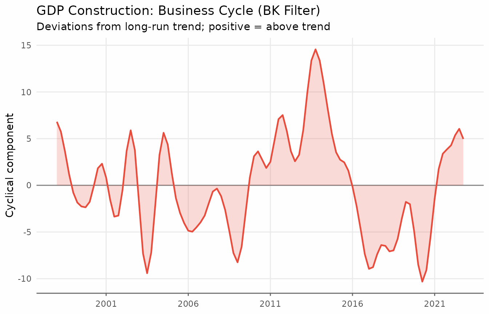

> **When to use BK:** It is the standard reference filter for business
> cycle analysis in academic research. Prefer it when reproducibility
> matters and the series is long enough.
>
> **When to avoid BK:** The rule of thumb is to have at least $`3 \times
> p_{u}`$ observations. With the default `pu = 32` quarters, that means
> at least 96 quarterly observations (24 years). Shorter series will
> have unreliable endpoint estimates.

### Christiano-Fitzgerald Filter

The CF filter relaxes the symmetry requirement: it is an **asymmetric
filter that uses all available observations**, including those near the
endpoints. As a result, it produces no missing values due to truncation.

The parameters are the same as for BK (`band = c(pl, pu)`) and the
economic interpretation is identical.

``` r

gdp_bk_cf <- augment_trends(
  gdp_construction,
  date_col = "date",
  value_col = "index",
  methods = c("bk", "cf")
)

gdp_cycles_long <- gdp_bk_cf |>
  mutate(
    `Baxter-King` = index - trend_bk,
    `Christiano-Fitzgerald` = index - trend_cf
  ) |>
  pivot_longer(
    cols = c(`Baxter-King`, `Christiano-Fitzgerald`),
    names_to = "filter",
    values_to = "cycle"
  )
```

``` r

ggplot(gdp_cycles_long, aes(date, cycle)) +
  geom_hline(yintercept = 0, color = "gray50", linewidth = 0.4) +
  geom_line(color = "#e74c3c", linewidth = 0.8, na.rm = TRUE) +
  geom_area(alpha = 0.15, fill = "#e74c3c", na.rm = TRUE) +
  facet_wrap(vars(filter), ncol = 2) +
  scale_x_date(date_breaks = "5 years", date_labels = "%Y") +
  labs(
    title    = "Business Cycle: Baxter-King vs. Christiano-Fitzgerald",
    subtitle = "Both isolate cycles of 6–32 quarters; CF has no endpoint NAs",
    x = NULL, y = "Cyclical component"
  ) +
  theme_series
```

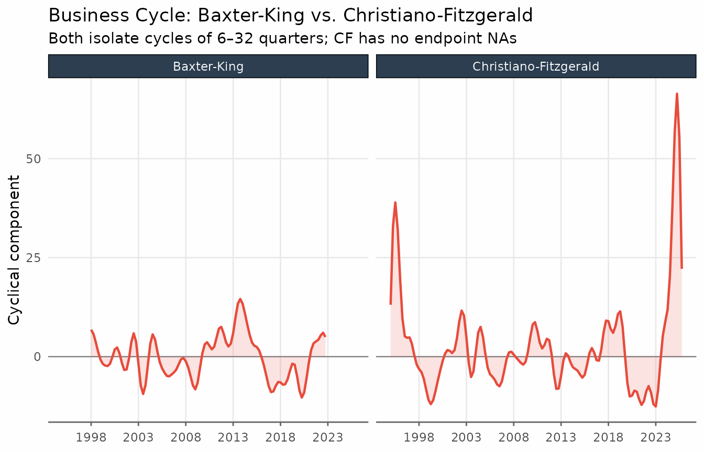

The two filters track each other closely in the interior of the sample.
The CF filter’s main advantage is its ability to provide estimates at
the endpoints, making it the safer default when the sample is short or
when recent values are important.

------------------------------------------------------------------------

## The Hodrick-Prescott Filter

The Hodrick-Prescott (HP) filter is one of the most widely used
trend-extraction methods in macroeconomics. It finds the trend
$`\{\tau_t\}`$ that solves the penalised least-squares problem

``` math
\min_{\{\tau_t\}} \sum_{t=1}^{T}(y_t - \tau_t)^2
  + \lambda \sum_{t=2}^{T-1}(\Delta^2 \tau_t)^2
```

where $`\Delta^2 \tau_t = \tau_t - 2\tau_{t-1} + \tau_{t-2}`$ is the
second difference. The smoothing parameter $`\lambda`$ trades off fit
against smoothness: larger values force $`\tau_t`$ closer to a linear
trend. The standard values are **$`\lambda = 1600`$** for quarterly data
and **$`\lambda =
14400`$** for monthly data. These defaults typically produce very smooth
trends.

``` r

ibcbr_hp <- augment_trends(ibcbr, value_col = "index", methods = "hp")

head(ibcbr_hp)
#> # A tibble: 6 × 3
#>   date       index trend_hp
#>   <date>     <dbl>    <dbl>
#> 1 2003-01-01  67.1     69.0
#> 2 2003-02-01  68.8     69.3
#> 3 2003-03-01  72.2     69.6
#> 4 2003-04-01  71.3     69.9
#> 5 2003-05-01  70.0     70.2
#> 6 2003-06-01  68.8     70.5
```

``` r

ggplot(ibcbr_hp, aes(date)) +
  geom_line(aes(y = index,    color = "Original"), linewidth = 0.6, alpha = 0.7) +
  geom_line(aes(y = trend_hp, color = "Trend: HP (λ = 14,400)"),
            linewidth = 0.9) +
  scale_x_date(date_breaks = "3 years", date_labels = "%Y") +
  labs(
    title = "IBC-Br: Hodrick-Prescott Filter",
    x = NULL, y = "Index", color = NULL
  ) +
  theme_series
```

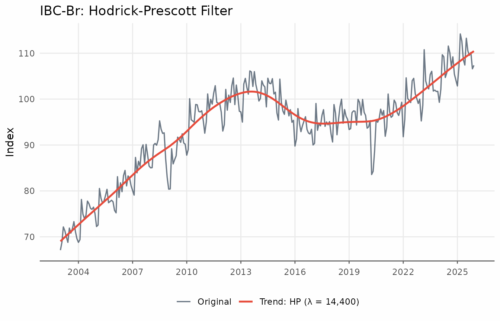

#### The smoothing parameter $`\lambda`$

The `smoothing` argument controls $`\lambda`$. Values above 1 are used
directly; values in $`(0, 1]`$ are interpreted as a fraction of the
standard lambda.

``` r

hp_lambdas <- ibcbr |>
  filter(date >= as.Date("2010-01-01")) |>
  augment_trends(
    value_col = "index",
    methods = "hp",
    smoothing = 1600,
    .quiet = TRUE
  ) |>
  augment_trends(
    value_col = "index",
    methods = "hp",
    smoothing = 14400,
    .quiet = TRUE
  ) |>
  augment_trends(
    value_col = "index",
    methods = "hp",
    smoothing = 129600,
    .quiet = TRUE
  )
```

``` r

hp_lambdas_long <- hp_lambdas |>
  pivot_longer(
    cols = starts_with("trend_hp"),
    names_to = "lambda",
    values_to = "trend"
  ) |>
  mutate(
    lambda = factor(
      lambda,
      levels = c("trend_hp", "trend_hp_1", "trend_hp_2"),
      labels = c("λ = 1,600", "λ = 14,400 (default)", "λ = 129,600")
    )
  )

ggplot(hp_lambdas_long, aes(date, trend)) +
  geom_line(
    data = hp_lambdas,
    aes(y = index),
    color = "gray60",
    linewidth = 0.5
  ) +
  geom_line(color = "#2c3e50", linewidth = 0.9) +
  facet_wrap(vars(lambda), ncol = 3) +
  scale_x_date(date_breaks = "3 years", date_labels = "%Y") +
  labs(
    title = "HP Filter: Effect of the Smoothing Parameter λ",
    subtitle = "Gray = original series; larger λ → smoother trend, closer to a linear fit",
    x = NULL,
    y = "Index"
  ) +
  theme_series
```

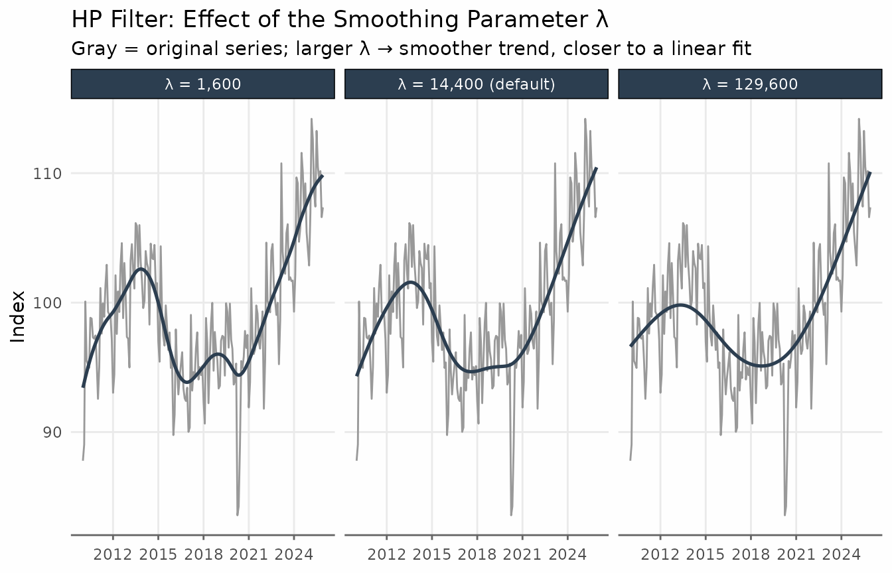

> **When to use HP:** It is the standard benchmark in academic macro and
> is directly comparable across studies that use the same $`\lambda`$.
> The two-sided HP filter (the default) provides a balanced trend with
> no asymmetric lag.
>
> **Known limitations:** The HP filter suffers from an **endpoint
> problem** — the trend at recent observations is strongly influenced by
> the last data point and can exhibit spurious movements. Hamilton
> (2018) shows that the HP filter can introduce spurious cyclicality
> even in random walk processes. For real-time or end-of-sample
> analysis, consider the one-sided HP filter
> (`params = list(hp_onesided = TRUE)`) or the Hamilton filter.

------------------------------------------------------------------------

## The Hamilton Filter

Hamilton (2018) proposed a regression-based alternative specifically
designed to avoid the HP filter’s shortcomings. The idea is to regress
the value $`h`$ periods ahead on $`p`$ lags of the current level:

``` math
y_{t+h} = \alpha + \beta_1 y_t + \beta_2 y_{t-1} + \cdots + \beta_p y_{t-p+1} + \varepsilon_{t+h}
```

The **fitted values** $`\hat{y}_{t+h}`$ serve as the trend estimate. The
residuals $`\hat{\varepsilon}_{t+h}`$ form the cyclical component.

The recommended parameters from Hamilton (2018) are:

- **Monthly data:** $`h = 24`$ (two years ahead), $`p = 12`$ (one year
  of lags)
- **Quarterly data:** $`h = 8`$ (two years ahead), $`p = 4`$ (one year
  of lags)

For quarterly data the regression written out in full is:

``` math
y_{t+8} = \alpha + \beta_1 y_t + \beta_2 y_{t-1} + \beta_3 y_{t-2} + \beta_4 y_{t-3} + \varepsilon_{t+8}
```

These are the defaults in `trendseries` for monthly and quarterly series
respectively. Because the regressors require $`p`$ consecutive lags and
the dependent variable requires $`h`$ forward observations, the first
$`h + p - 1`$ observations have no trend estimate.

``` r

ibcbr_hamilton <- augment_trends(
  ibcbr,
  value_col = "index",
  methods = "hamilton"
)

head(ibcbr_hamilton)
#> # A tibble: 6 × 3
#>   date       index trend_hamilton
#>   <date>     <dbl>          <dbl>
#> 1 2003-01-01  67.1             NA
#> 2 2003-02-01  68.8             NA
#> 3 2003-03-01  72.2             NA
#> 4 2003-04-01  71.3             NA
#> 5 2003-05-01  70.0             NA
#> 6 2003-06-01  68.8             NA
```

``` r

ggplot(ibcbr_hamilton, aes(date)) +
  geom_line(aes(y = index, color = "Original"), linewidth = 0.6, alpha = 0.7) +
  geom_line(
    aes(y = trend_hamilton, color = "Trend: Hamilton"),
    linewidth = 0.9,
    na.rm = TRUE
  ) +
  scale_x_date(date_breaks = "3 years", date_labels = "%Y") +
  labs(
    title = "IBC-Br: Hamilton Filter",
    subtitle = paste0(
      "Fitted values from y[t+24] ~ y[t] + ... + y[t-11]; ",
      "first 35 rows are NA (h + p - 1 = 24 + 12 - 1)"
    ),
    x = NULL,
    y = "Index",
    color = NULL
  ) +
  theme_series
```

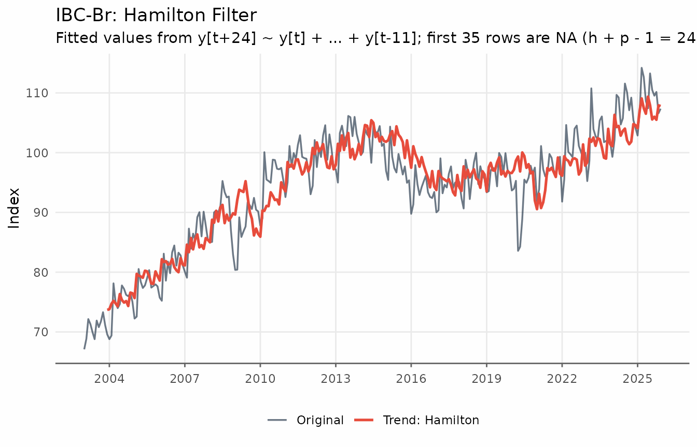

The cyclical component — the deviations of the series from the Hamilton
trend — reveals the business cycle as estimated by the regression
residuals.

``` r

ibcbr_hamilton_cycle <- ibcbr_hamilton |>
  mutate(cycle = index - trend_hamilton) |>
  filter(!is.na(cycle))

ggplot(ibcbr_hamilton_cycle, aes(date, cycle)) +
  geom_hline(yintercept = 0, color = "gray50", linewidth = 0.5) +
  geom_line(linewidth = 0.8, color = "#e74c3c") +
  geom_area(alpha = 0.2, fill = "#e74c3c") +
  scale_x_date(date_breaks = "3 years", date_labels = "%Y") +
  labs(
    title    = "IBC-Br: Cyclical Component (Hamilton Filter)",
    subtitle = "Residuals from the Hamilton regression; positive = above trend",
    x = NULL, y = "Cyclical component"
  ) +
  theme_series
```

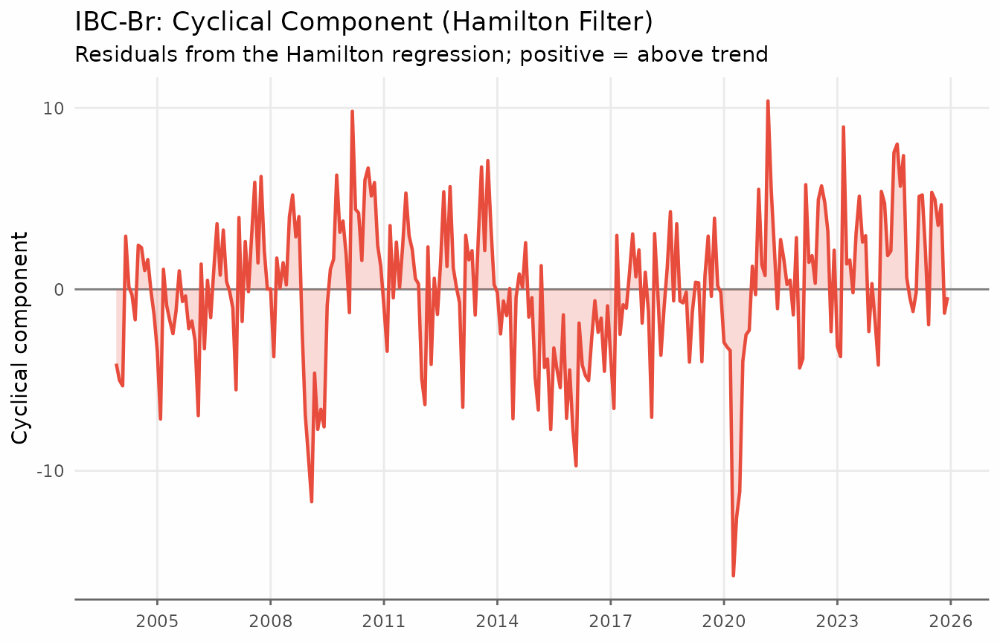

#### Hamilton vs. HP

The key differences between the two filters become visible when
comparing them side by side. In contrast to the HP filter, the Hamilton
trend shows more variability — it reacts faster to structural changes
and does not exhibit the smooth “gliding” behaviour that HP produces
near the endpoints of the sample.

``` r

hp_vs_ham <- ibcbr |>
  filter(date >= as.Date("2010-01-01")) |>
  augment_trends(
    value_col = "index",
    methods = c("hp", "hamilton"),
    .quiet = TRUE
  )
```

``` r

hp_ham_long <- hp_vs_ham |>
  pivot_longer(
    cols = c(trend_hp, trend_hamilton),
    names_to = "filter",
    values_to = "trend"
  ) |>
  mutate(
    filter = recode(
      filter,
      trend_hp = "HP (λ = 14,400)",
      trend_hamilton = "Hamilton (h = 24, p = 12)"
    )
  )

ggplot(hp_ham_long, aes(date, trend)) +
  geom_line(
    data = hp_vs_ham,
    aes(y = index),
    color = "gray70",
    linewidth = 0.5
  ) +
  geom_line(color = "#2c3e50", linewidth = 0.9, na.rm = TRUE) +
  facet_wrap(vars(filter), ncol = 2) +
  scale_x_date(date_breaks = "2 years", date_labels = "%Y") +
  labs(
    title = "HP vs. Hamilton Filter on IBC-Br",
    subtitle = "Gray = original series; HP is smoother, Hamilton reacts faster and avoids endpoint distortion",
    x = NULL,
    y = "Index"
  ) +
  theme_series
```

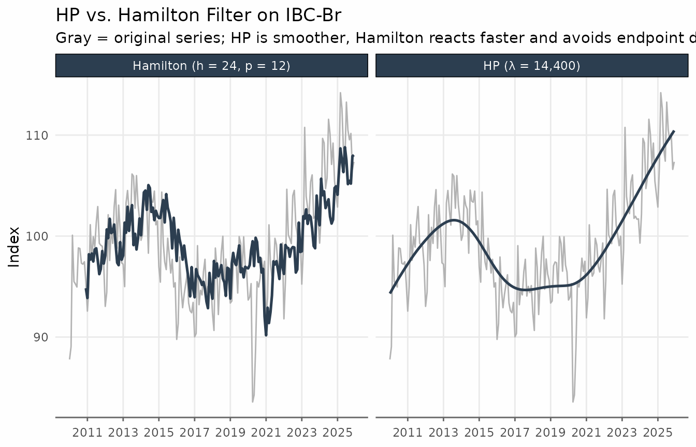

> **When to use Hamilton:** Prefer it when the endpoint problem of HP is
> a concern (e.g., near real-time analysis), or when you want a trend
> that is robust to the critiques in Hamilton (2018). It is also
> straightforward to interpret: the trend is simply a projection of the
> future level onto past values.
>
> **Limitations:** The first $`h + p - 1`$ observations have no trend
> estimate (35 months for the default monthly settings, 11 quarters for
> quarterly). Unlike the HP filter, the trend is available all the way
> to the last observation in the sample.

------------------------------------------------------------------------

## All Filters Together

Applying several filters simultaneously is straightforward with
`augment_trends`. The comparison below uses the IBC-Br after 2010, where
all filters have sufficient data.

``` r

ibcbr_all <- ibcbr |>
  filter(date >= as.Date("2010-01-01")) |>
  augment_trends(
    value_col = "index",
    methods = c("henderson", "spencer", "hp", "hamilton"),
    .quiet = TRUE
  )
```

``` r

ibcbr_all_long <- ibcbr_all |>
  pivot_longer(
    cols = c(trend_henderson, trend_spencer, trend_hp, trend_hamilton),
    names_to = "filter",
    values_to = "trend"
  ) |>
  mutate(
    filter = factor(
      filter,
      levels = c(
        "trend_henderson",
        "trend_spencer",
        "trend_hp",
        "trend_hamilton"
      ),
      labels = c(
        "Henderson (13-term)",
        "Spencer (15-term)",
        "HP (λ = 14,400)",
        "Hamilton (h=24, p=12)"
      )
    )
  )

ggplot(ibcbr_all_long, aes(date, trend)) +
  geom_line(
    data = ibcbr_all,
    aes(y = index),
    color = "gray70",
    linewidth = 0.5
  ) +
  geom_line(color = "#2c3e50", linewidth = 0.8, na.rm = TRUE) +
  facet_wrap(vars(filter), ncol = 2) +
  scale_x_date(date_breaks = "3 years", date_labels = "%Y") +
  labs(
    title = "IBC-Br: All Filters Compared",
    subtitle = "Gray = original series",
    x = NULL,
    y = "Index"
  ) +
  theme_series
```

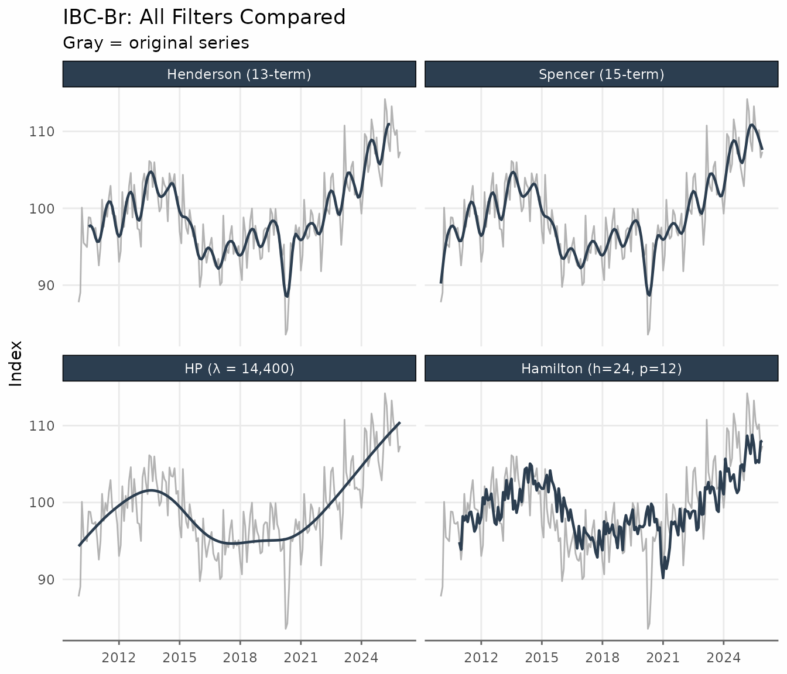

The Henderson and Spencer filters are the smoothest and closest to each
other. HP produces a similar result but is derived from a different
optimisation criterion. Hamilton tracks the series more closely and
shows more residual variation in the trend.

## Quick Reference

| Filter | Key parameter | Default (monthly) | Endpoint NAs | Main use |
|----|----|----|----|----|
| `henderson` | `window` (odd integer) | 13 | `floor(window/2)` each end | Official statistics, X-11/X-13 |
| `spencer` | — | 15 (fixed) | 0 (extrapolated) | Classical smoothing |
| `bk` | `band = c(pl, pu)` | `c(6, 32)` | ~`pu/2` each end | Business cycle isolation, long series |
| `cf` | `band = c(pl, pu)` | `c(6, 32)` | 0 | Business cycle isolation, any length |
| `hp` | `smoothing` (λ) | 14 400 | 0 | Macro benchmark, cycle extraction |
| `hamilton` | `params` (h, p) | h=24, p=12 | First h+p−1 | Real-time trend, HP alternative |

## References

Baxter, M. & King, R. G. (1999). Measuring business cycles: Approximate
band-pass filters for economic time series. *Review of Economics and
Statistics*, 81(4), 575–593.

Christiano, L. J. & Fitzgerald, T. J. (2003). The band pass filter.
*International Economic Review*, 44(2), 435–465.

Hamilton, J. D. (2018). Why you should never use the Hodrick-Prescott
filter. *Review of Economics and Statistics*, 100(5), 831–843.

Henderson, R. (1916). Note on graduation by adjusted average.
*Transactions of the Actuarial Society of America*, 17, 43–48.

Hodrick, R. J. & Prescott, E. C. (1997). Postwar U.S. business cycles:
An empirical investigation. *Journal of Money, Credit and Banking*,
29(1), 1–16.

Ravn, M. O. & Uhlig, H. (2002). On adjusting the Hodrick-Prescott filter
for the frequency of observations. *Review of Economics and Statistics*,
84(2), 371–376.
