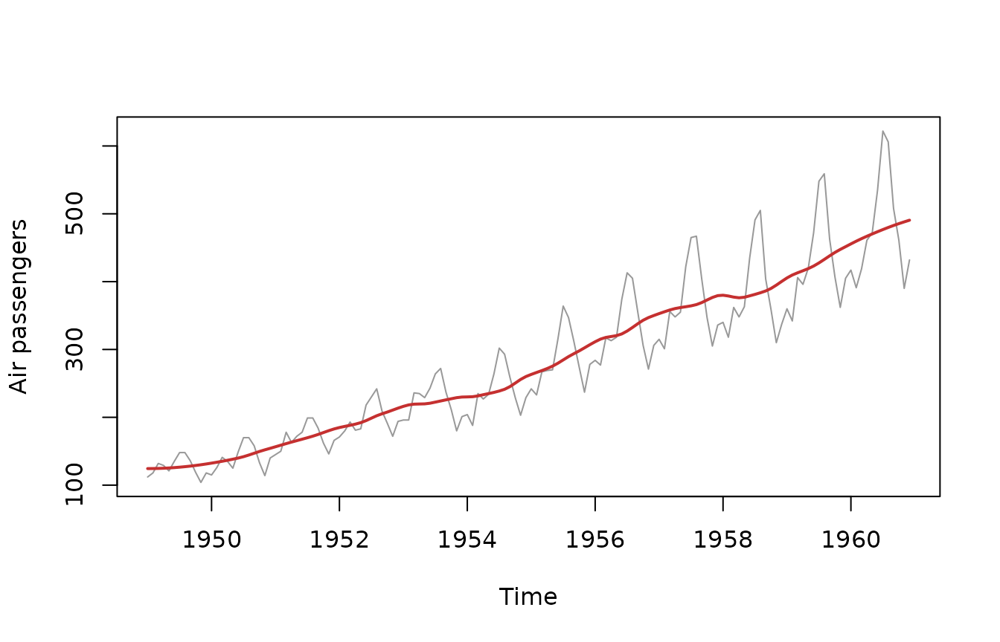

# Trend Extraction Methods

``` r

library(trendseries)
```

This vignette is a catalogue of every trend-extraction method in
`trendseries`: which family it belongs to, when to reach for it, and
which parameters it accepts. For worked examples of specific families,
see the companion [Moving
Averages](https://viniciusoike.github.io/trendseries/articles/moving-averages.md)
and [Econometric
Filters](https://viniciusoike.github.io/trendseries/articles/econometric-filters.md)
vignettes. To split a series into trend, seasonal, and remainder
components instead of extracting a single smooth trend, see [Decomposing
Series](https://viniciusoike.github.io/trendseries/articles/decompose-series.md).

## The two interfaces

Every method is reachable through two functions that share the same
engine and the same parameters:

- [`augment_trends()`](https://viniciusoike.github.io/trendseries/reference/augment_trends.md)
  — pipe-friendly. Takes a `data.frame`/`tibble`, adds `trend_{method}`
  columns, and supports grouped series via `group_cols`.
- [`extract_trends()`](https://viniciusoike.github.io/trendseries/reference/extract_trends.md)
  — takes a `ts`/`xts`/`zoo` object and returns `ts` objects (a single
  `ts` for one method, a named list for several).

``` r

# Data-frame interface: adds a trend_stl column
head(augment_trends(ibcbr, value_col = "index", methods = "stl"))
#> # A tibble: 6 × 3
#>   date       index trend_stl
#>   <date>     <dbl>     <dbl>
#> 1 2003-01-01  67.1      70.2
#> 2 2003-02-01  68.8      70.2
#> 3 2003-03-01  72.2      70.3
#> 4 2003-04-01  71.3      70.4
#> 5 2003-05-01  70.0      70.5
#> 6 2003-06-01  68.8      70.7
```

``` r

# Time-series interface: returns a ts object
hp_trend <- extract_trends(AirPassengers, methods = "hp")
class(hp_trend)
#> [1] "ts"
```

Pass several methods at once to compare them:

``` r

trends <- augment_trends(
  ibcbr,
  value_col = "index",
  methods = c("hp", "stl", "henderson")
)
head(trends)
#> # A tibble: 6 × 5
#>   date       index trend_hp trend_stl trend_henderson
#>   <date>     <dbl>    <dbl>     <dbl>           <dbl>
#> 1 2003-01-01  67.1     69.0      70.2              NA
#> 2 2003-02-01  68.8     69.3      70.2              NA
#> 3 2003-03-01  72.2     69.6      70.3              NA
#> 4 2003-04-01  71.3     69.9      70.4              NA
#> 5 2003-05-01  70.0     70.2      70.5              NA
#> 6 2003-06-01  68.8     70.5      70.7              NA
```

## The unified parameter system

Rather than exposing every method’s idiosyncratic arguments,
`trendseries` routes a small set of *generic* parameters to whichever
method-specific option they correspond to. Sensible, frequency-aware
defaults mean you rarely need to set them.

| Parameter | Applies to | Meaning |
|----|----|----|
| `window` | moving-average methods (`ma`, `wma`, `triangular`, `ewma`, `median`, `gaussian`, `stl`) | Number of observations in the smoothing window. |
| `smoothing` | `hp`, `loess`, `spline`, `ewma`, `kernel`, `kalman` | Amount of smoothing (interpretation varies by method). |
| `band` | bandpass filters (`bk`, `cf`) | `c(low, high)` cycle periods to keep. |
| `align` | `ma`, `wma`, `triangular`, `gaussian` | `"center"` (default), `"right"` (causal), or `"left"`. |
| `params` | all | A named list for any remaining method-specific options. |

``` r

# A wider HP smoothing and a 12-month moving average, in one call
augment_trends(
  ibcbr,
  value_col = "index",
  methods = c("hp", "ma"),
  smoothing = 1600,
  window = 12
) |>
  head()
#> # A tibble: 6 × 4
#>   date       index trend_hp trend_ma
#>   <date>     <dbl>    <dbl>    <dbl>
#> 1 2003-01-01  67.1     68.9     NA  
#> 2 2003-02-01  68.8     69.2     NA  
#> 3 2003-03-01  72.2     69.5     NA  
#> 4 2003-04-01  71.3     69.9     NA  
#> 5 2003-05-01  70.0     70.2     NA  
#> 6 2003-06-01  68.8     70.5     70.6
```

Frequency-aware defaults adapt to the data: for monthly series the HP
smoothing parameter defaults to `lambda = 14400` and the moving-average
window to 12; for quarterly series, `lambda = 1600` and a window of 4
(Ravn & Uhlig, 2002).

## Method catalogue

`trendseries` ships 20 trend methods across four families.

| Method | Category | Description | Typical use |
|----|----|----|----|
| `hp` | econometric | Hodrick-Prescott filter | General-purpose business-cycle trend |
| `hamilton` | econometric | Hamilton regression filter | HP alternative without spurious cycles |
| `bn` | econometric | Beveridge-Nelson decomposition | Permanent/transitory split |
| `ucm` | econometric | Unobserved components model | Model-based, stochastic trend |
| `bk` | bandpass | Baxter-King bandpass filter | Isolating a cycle frequency band |
| `cf` | bandpass | Christiano-Fitzgerald bandpass filter | Asymmetric bandpass, uses endpoints |
| `ma` | moving average | Simple moving average | Quick, intuitive smoothing |
| `wma` | moving average | Weighted moving average | Smoothing with custom weights |
| `ewma` | moving average | Exponentially weighted moving average | Recent-weighted, real-time smoothing |
| `triangular` | moving average | Triangular moving average | Smoother than a simple MA |
| `median` | moving average | Median filter | Robust to outliers/spikes |
| `gaussian` | moving average | Gaussian-weighted moving average | Smooth, bell-weighted average |
| `spencer` | moving average | Spencer’s 15-term moving average | Classic actuarial graduation |
| `henderson` | moving average | Henderson moving average | Trend term inside X-11 seasonal adj. |
| `stl` | smoothing | Seasonal-trend decomposition via Loess | Trend from strongly seasonal data |
| `loess` | smoothing | Local polynomial regression | Flexible non-parametric trend |
| `spline` | smoothing | Smoothing splines | Smooth curve with automatic penalty |
| `poly` | smoothing | Polynomial trends | Simple global trend shape |
| `kernel` | smoothing | Kernel smoother | Non-parametric, bandwidth-controlled |
| `kalman` | smoothing | Kalman filter/smoother | Adaptive trend for noisy series |

### Moving averages

Moving-average methods replace each point with a (possibly weighted)
average of its neighbours. They are fast, transparent, and a good
default for exploratory work. Control the smoothing through `window`
(and `align` for causal vs. centred variants). `ma`, `median`, and
`henderson` also accept a *vector* of windows, returning one trend per
window.

``` r

augment_trends(
  ibcbr,
  value_col = "index",
  methods = "henderson",
  window = c(13, 23)
) |>
  head()
#> # A tibble: 6 × 4
#>   date       index trend_henderson_13 trend_henderson_23
#>   <date>     <dbl>              <dbl>              <dbl>
#> 1 2003-01-01  67.1                 NA                 NA
#> 2 2003-02-01  68.8                 NA                 NA
#> 3 2003-03-01  72.2                 NA                 NA
#> 4 2003-04-01  71.3                 NA                 NA
#> 5 2003-05-01  70.0                 NA                 NA
#> 6 2003-06-01  68.8                 NA                 NA
```

See [Moving
Averages](https://viniciusoike.github.io/trendseries/articles/moving-averages.md)
for the full treatment.

### Smoothing methods

Smoothing methods fit a flexible curve to the data. `stl` and `loess`
are locally adaptive; `spline` and `kernel` trade off fit against
smoothness through a penalty/bandwidth; `poly` imposes a single global
shape. The `smoothing` parameter tunes how aggressively they smooth.

``` r

loess_trend <- extract_trends(AirPassengers, methods = "loess", smoothing = 0.3)
plot(AirPassengers, col = "grey60", ylab = "Air passengers")
lines(loess_trend, col = "#C53030", lwd = 2)
```



### Econometric filters

These are the workhorses of applied macroeconomics. The Hodrick-Prescott
filter (`hp`) is the most widely used; `hamilton` is a regression-based
alternative that avoids HP’s well-known spurious-cycle artefacts; `bn`
and `ucm` are model-based decompositions into permanent and transitory
parts.

``` r

augment_trends(
  gdp_construction,
  value_col = "index",
  methods = c("hp", "hamilton")
) |>
  head()
#> # A tibble: 6 × 4
#>   date       index trend_hp trend_hamilton
#>   <date>     <dbl>    <dbl>          <dbl>
#> 1 1995-01-01 100       101.             NA
#> 2 1995-04-01 100       101.             NA
#> 3 1995-07-01 100       102.             NA
#> 4 1995-10-01 100       103.             NA
#> 5 1996-01-01  97.8     103.             NA
#> 6 1996-04-01 101.      104.             NA
```

The HP filter has a one-sided (real-time) variant for nowcasting, where
future observations must not influence the current estimate:

``` r

extract_trends(
  AirPassengers,
  methods = "hp",
  params = list(hp_onesided = TRUE)
) |>
  head()
#>           Jan      Feb      Mar      Apr      May      Jun
#> 1949 111.9999 118.0001 130.6667 132.5000 128.1995 133.1425
```

See [Econometric
Filters](https://viniciusoike.github.io/trendseries/articles/econometric-filters.md)
for details.

### Bandpass filters

Bandpass filters (`bk`, `cf`) keep only the fluctuations whose
periodicity falls inside a chosen band, removing both the long-run trend
and high-frequency noise. Specify the band with `band = c(low, high)` in
periods (quarters for quarterly data):

``` r

extract_trends(
  AirPassengers,
  methods = "cf",
  band = c(18, 96)
) |>
  head()
#>           Jan      Feb      Mar      Apr      May      Jun
#> 1949 129.2137 124.0873 127.3082 114.4644  98.0897 105.6196
```

## Decomposition vs. trend extraction

The methods above estimate a single smooth *trend*. When you instead
want to split a series into **trend + seasonal + remainder**, use
[`decompose_series()`](https://viniciusoike.github.io/trendseries/reference/decompose_series.md),
which offers five methods of its own:

| Method | Engine | Notes |
|----|----|----|
| `stl` | [`stats::stl()`](https://rdrr.io/r/stats/stl.html) | Loess-based, robust option available. |
| `regression` | OLS | Polynomial trend + seasonal dummies. |
| `classic` | [`stats::decompose()`](https://rdrr.io/r/stats/decompose.html) | Classical moving-average; additive or multiplicative. |
| `bsm` | [`stats::StructTS()`](https://rdrr.io/r/stats/StructTS.html) | State-space model; components for every point. |
| `seats` | X-13ARIMA-SEATS | Requires the optional **`seasonal`** package. |

``` r

decompose_series(gdp_construction, value_col = "index", methods = "stl") |>
  head()
#> # A tibble: 6 × 5
#>   date       index trend_stl seasonal_stl remainder_stl
#>   <date>     <dbl>     <dbl>        <dbl>         <dbl>
#> 1 1995-01-01 100       102.         -4.37         1.93 
#> 2 1995-04-01 100       101.         -1.62         0.476
#> 3 1995-07-01 100       100.          4.44        -4.62 
#> 4 1995-10-01 100        99.4         1.55        -0.946
#> 5 1996-01-01  97.8     101.         -4.37         1.42 
#> 6 1996-04-01 101.      102.         -1.62         0.613
```

The dedicated [Decomposing
Series](https://viniciusoike.github.io/trendseries/articles/decompose-series.md)
vignette covers these in depth.

## References

Ravn, M. O., & Uhlig, H. (2002). On adjusting the Hodrick-Prescott
filter for the frequency of observations. *The Review of Economics and
Statistics*, 84(2), 371–376.
