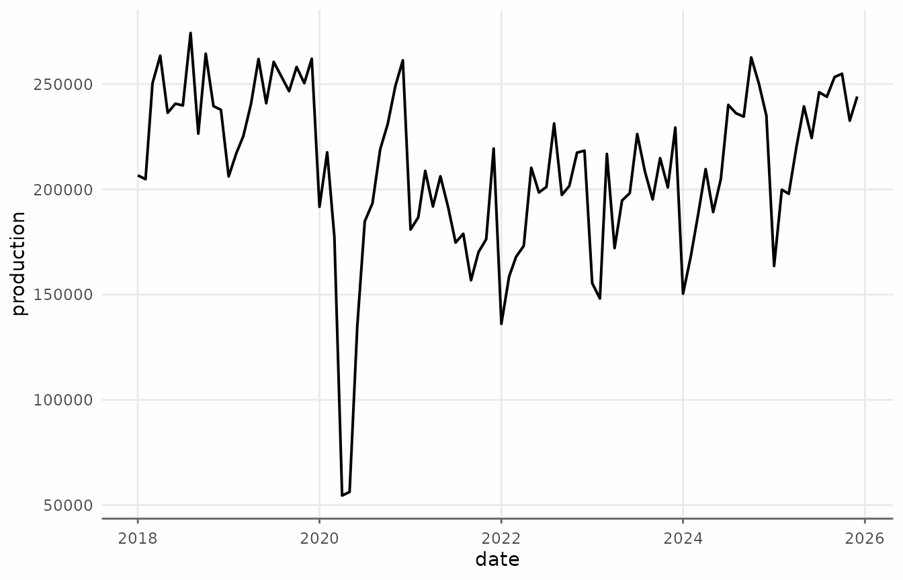
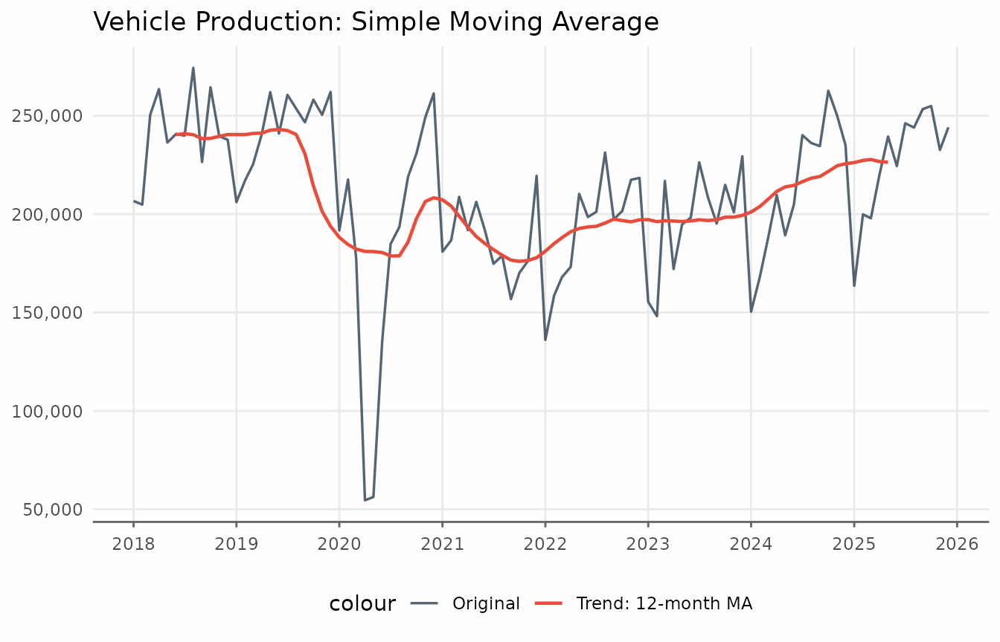
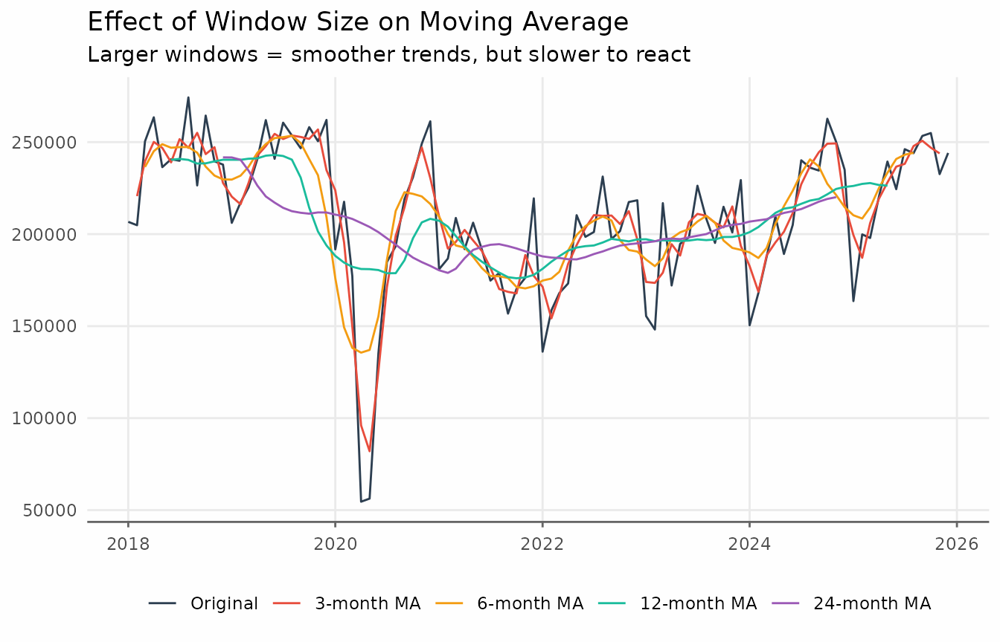
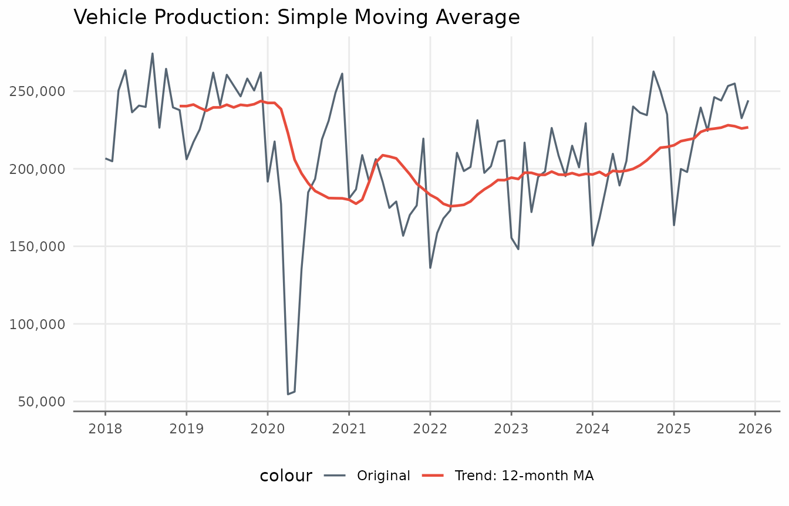
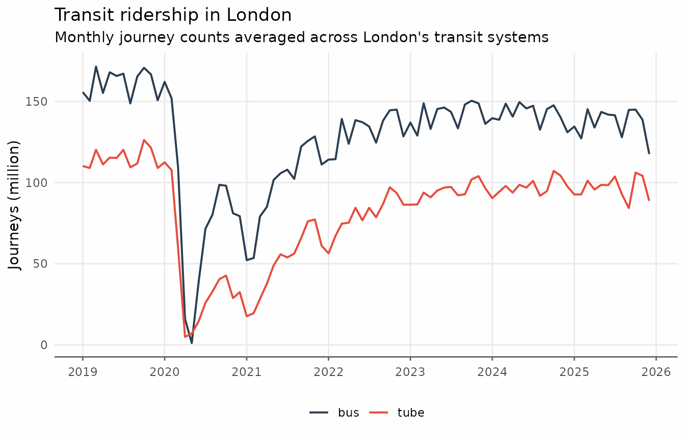
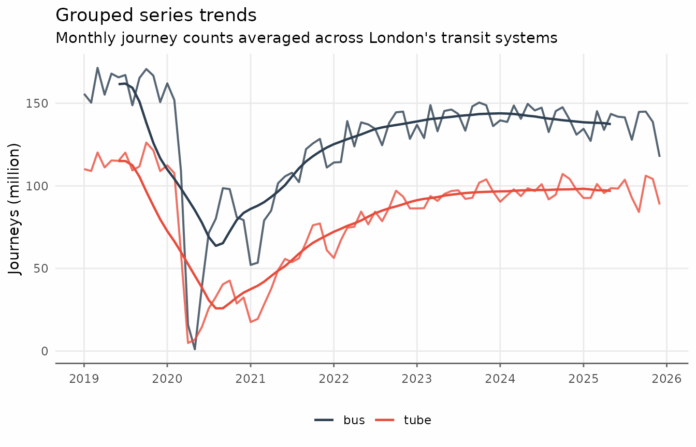
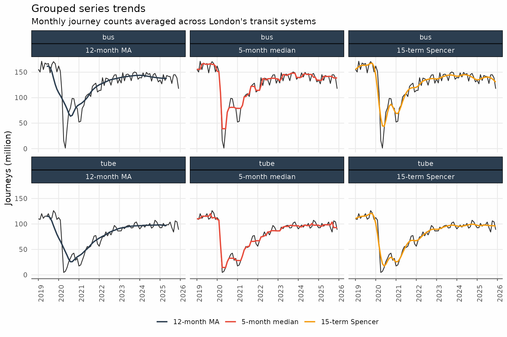

# Moving Averages for Trend Analysis

## Moving Averages

Moving averages are one of the most intuitive and widely-used tools for
extracting trends from time series data. The basic idea is simple:
average nearby observations to smooth out random fluctuations.

### Simple example

``` r

library(trendseries)
library(dplyr)
library(ggplot2)
```

To recreate the plots from this tutorial use `theme_series` below.

``` r

theme_series <- theme_minimal(paper = "#fefefe") +
  theme(
    legend.position = "bottom",
    panel.grid.minor = element_blank(),
    strip.background = element_rect(fill = "#2c3e50"),
    strip.text = element_text(color = "#fefefe"),
    axis.ticks.x = element_line(color = "gray40", linewidth = 0.5),
    axis.line.x = element_line(color = "gray40", linewidth = 0.5),
    # Use colors
    palette.colour.discrete = c(
      "#2c3e50",
      "#e74c3c",
      "#f39c12",
      "#1abc9c",
      "#9b59b6"
    )
  )
```

Let’s start with vehicle production data. This series is packaged with
`trendseries` and shows the amount of vehicles produced in Brazil per
month.

``` r

# Using the 'vehicles' dataset (ships with trendseries)
vehicles_recent <- vehicles |>
  # Only use data after 2018
  filter(date >= as.Date("2018-01-01"))

ggplot(vehicles_recent, aes(date, production)) +
  geom_line(lwd = 0.7) +
  theme_series
```



Applying
[`augment_trends()`](https://viniciusoike.github.io/trendseries/reference/augment_trends.md)
to the `vehicles` dataset creates a new column called `trend_ma`.

``` r

# Apply a moving average trend
vehicles_trend <- augment_trends(
  vehicles_recent,
  value_col = "production",
  methods = "ma",
  window = 12
)


vehicles_trend
#> # A tibble: 96 × 3
#>    date       production trend_ma
#>    <date>          <dbl>    <dbl>
#>  1 2018-01-01     206675      NA 
#>  2 2018-02-01     204831      NA 
#>  3 2018-03-01     250423      NA 
#>  4 2018-04-01     263490      NA 
#>  5 2018-05-01     236388      NA 
#>  6 2018-06-01     240714  240386.
#>  7 2018-07-01     239856  240879.
#>  8 2018-08-01     274312  240348.
#>  9 2018-09-01     226447  238350.
#> 10 2018-10-01     264434  238466.
#> # ℹ 86 more rows
```

We can visualize this trend using `ggplot2`.

``` r

ggplot(vehicles_trend, aes(date)) +
  geom_line(aes(y = production, color = "Original"), lwd = 0.6, alpha = 0.8) +
  geom_line(aes(y = trend_ma, color = "Trend: 12-month MA"), lwd = 0.8) +
  scale_x_date(date_breaks = "1 year", date_labels = "%Y") +
  scale_y_continuous(labels = scales::label_comma()) +
  labs(x = NULL, y = NULL, title = "Vehicle Production: Simple Moving Average") +
  theme_series
```



The `augment_trends` function accepts a vector of values for `window`.
Each window size produces its own column: `trend_ma_3`, `trend_ma_6`,
`trend_ma_12`, `trend_ma_24`.

``` r

# Apply different window sizes
windows_to_test <- c(3, 6, 12, 24)

vehicles_trend <- vehicles_recent |>
  augment_trends(
    value_col = "production",
    methods = "ma",
    window = windows_to_test
  )

vehicles_trend
#> # A tibble: 96 × 6
#>    date       production trend_ma_3 trend_ma_6 trend_ma_12 trend_ma_24
#>    <date>          <dbl>      <dbl>      <dbl>       <dbl>       <dbl>
#>  1 2018-01-01     206675        NA         NA          NA           NA
#>  2 2018-02-01     204831    220643         NA          NA           NA
#>  3 2018-03-01     250423    239581.    236519.         NA           NA
#>  4 2018-04-01     263490    250100.    245074.         NA           NA
#>  5 2018-05-01     236388    246864     248866.         NA           NA
#>  6 2018-06-01     240714    238986     246946.     240386.          NA
#>  7 2018-07-01     239856    251627.    247288.     240879.          NA
#>  8 2018-08-01     274312    246872.    247309.     240348.          NA
#>  9 2018-09-01     226447    255064.    244254.     238350.          NA
#> 10 2018-10-01     264434    243476     236684.     238466.          NA
#> # ℹ 86 more rows
```

For plots with more series, reshaping the data to a “tidy” long format
is more convenient.

``` r

# Prepare for plotting
plot_data <- vehicles_trend |>
  pivot_longer(
    cols = c(production, starts_with("trend_ma")),
    names_to = "method",
    values_to = "value"
  ) |>
  mutate(
    method = factor(
      method,
      levels = c("production", paste0("trend_ma_", c(3, 6, 12, 24))),
      labels = c(
        "Original",
        "3-month MA",
        "6-month MA",
        "12-month MA",
        "24-month MA"
      )
    )
  )


# Plot
ggplot(plot_data, aes(date, value, color = method)) +
  geom_line() +
  labs(
    title = "Effect of Window Size on Moving Average",
    subtitle = "Larger windows = smoother trends, but slower to react",
    x = NULL,
    y = NULL,
    color = NULL
  ) +
  theme_series
```



Notice how the 24-month MA is very smooth but lags behind changes, while
the 3-month MA tracks the data closely but still shows some fluctuation.

`augment_trends` supports different alignments via the `align`
parameter.

``` r

vehicles_trend <- augment_trends(
  vehicles_recent,
  value_col = "production",
  methods = "ma",
  window = 12,
  align = "right"
)

ggplot(vehicles_trend, aes(date)) +
  geom_line(aes(y = production, color = "Original"), lwd = 0.6, alpha = 0.8) +
  geom_line(aes(y = trend_ma, color = "Trend: 12-month MA"), lwd = 0.8) +
  scale_x_date(date_breaks = "1 year", date_labels = "%Y") +
  scale_y_continuous(labels = scales::label_comma()) +
  labs(x = NULL, y = NULL, title = "Vehicle Production: Simple Moving Average") +
  theme_series
```



### Grouped series

Working with multiple time series is straightforward. The
`augment_trends` function accepts a `group_cols` argument to apply
methods to each group independently. The data must be in “tidy” long
format. Here we use the `transit_london_monthly` dataset, which
aggregates ridership by Bus and Train (tube).

``` r

transit <- transit_london_monthly

ggplot(transit, aes(date_month, journey_monthly, color = transit_mode)) +
  geom_line(lwd = 0.7) +
  scale_x_date(date_breaks = "1 year", date_labels = "%Y") +
  scale_y_continuous(labels = scales::label_comma(scale = 1e-6)) +
  labs(
    x = NULL,
    y = "Journeys (million)",
    title = "Transit ridership in London",
    subtitle = "Monthly journey counts averaged across London's transit systems",
    color = NULL
  ) +
  theme_series
```



``` r

transit_trends <- augment_trends(
  transit,
  date_col = "date_month",
  value_col = "journey_monthly",
  group_cols = "transit_mode",
  methods = "ma",
  window = 12
)

ggplot(transit_trends, aes(date_month, color = transit_mode)) +
  geom_line(aes(y = journey_monthly), lwd = 0.7, alpha = 0.8) +
  geom_line(aes(y = trend_ma), lwd = 0.8) +
  scale_x_date(date_breaks = "1 year", date_labels = "%Y") +
  scale_y_continuous(labels = scales::label_comma(scale = 1e-6)) +
  labs(
    x = NULL,
    y = "Journeys (million)",
    title = "Grouped series trends",
    subtitle = "Monthly journey counts averaged across London's transit systems",
    color = NULL
  ) +
  theme_series
```



### Related methods

Other window-based smoothing methods are available in `trendseries`,
selected via the `methods` parameter:

1.  Moving median `methods = "median"`.
2.  Weighted moving average `methods = "wma"`.
3.  Exponentially weighted moving average `methods = "ewma"`.
4.  Spencer moving average `methods = "spencer"`.
5.  Triangular moving average `methods = "triangular"`.

These different methods can be combined in a single call to
[`augment_trends()`](https://viniciusoike.github.io/trendseries/reference/augment_trends.md).

``` r

transit_trends <- augment_trends(
  transit,
  date_col = "date_month",
  value_col = "journey_monthly",
  group_cols = "transit_mode",
  methods = c("ma", "median", "spencer")
)
```

As with multiple windows, `augment_trends` creates a new column for each
method.

``` r

transit_trends
#> # A tibble: 168 × 6
#>    date_month transit_mode journey_monthly   trend_ma trend_median trend_spencer
#>    <date>     <chr>                  <dbl>      <dbl>        <dbl>         <dbl>
#>  1 2019-01-01 bus                155713000        NA     155713000    155453484.
#>  2 2019-02-01 bus                150361000        NA     155713000    158189068.
#>  3 2019-03-01 bus                171440000        NA     155713000    160595589.
#>  4 2019-04-01 bus                155185000        NA     165672000    162514135.
#>  5 2019-05-01 bus                167923000        NA     167075000    163487621.
#>  6 2019-06-01 bus                165672000 161553000     165672000    163582471.
#>  7 2019-07-01 bus                167075000 161880208.    165672000    163404607.
#>  8 2019-08-01 bus                148747000 159353542.    165672000    163807991.
#>  9 2019-09-01 bus                165315000 150961208.    166687000    165322150 
#> 10 2019-10-01 bus                170688000 138208583.    165315000    167443597.
#> # ℹ 158 more rows
```

Finally, we can visualize these different trends using `ggplot2`.

``` r

transit_trends <- augment_trends(
  transit,
  date_col = "date_month",
  value_col = "journey_monthly",
  group_cols = "transit_mode",
  methods = c("ma", "median", "spencer")
)

transit_trends_long <- transit_trends |>
  pivot_longer(
    cols = c(starts_with("trend_")),
    names_to = "method",
    names_repair = "unique"
  ) |>
  mutate(
    method = factor(
      method,
      levels = c(
        "trend_ma",
        "trend_median",
        "trend_spencer"
      ),
      labels = c(
        "12-month MA",
        "5-month median",
        "15-term Spencer"
      )
    )
  )

ggplot() +
  geom_line(
    data = transit_trends,
    aes(date_month, journey_monthly),
    lwd = 0.5,
    alpha = 0.8
  ) +
  geom_line(
    data = transit_trends_long,
    aes(date_month, value, color = method),
    lwd = 0.8
  ) +
  facet_wrap(vars(transit_mode, method), ncol = 3) +
  scale_x_date(date_breaks = "1 year", date_labels = "%Y") +
  scale_y_continuous(labels = scales::label_comma(scale = 1e-6)) +
  labs(
    x = NULL,
    y = "Journeys (million)",
    title = "Grouped series trends",
    subtitle = "Monthly journey counts averaged across London's transit systems",
    color = NULL
  ) +
  theme_series +
  theme(
    axis.text.x = element_text(angle = 90)
  )
```


