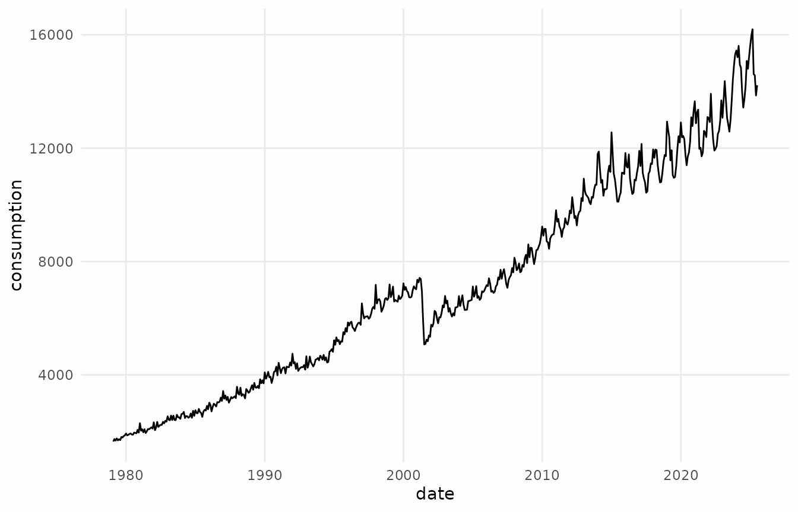
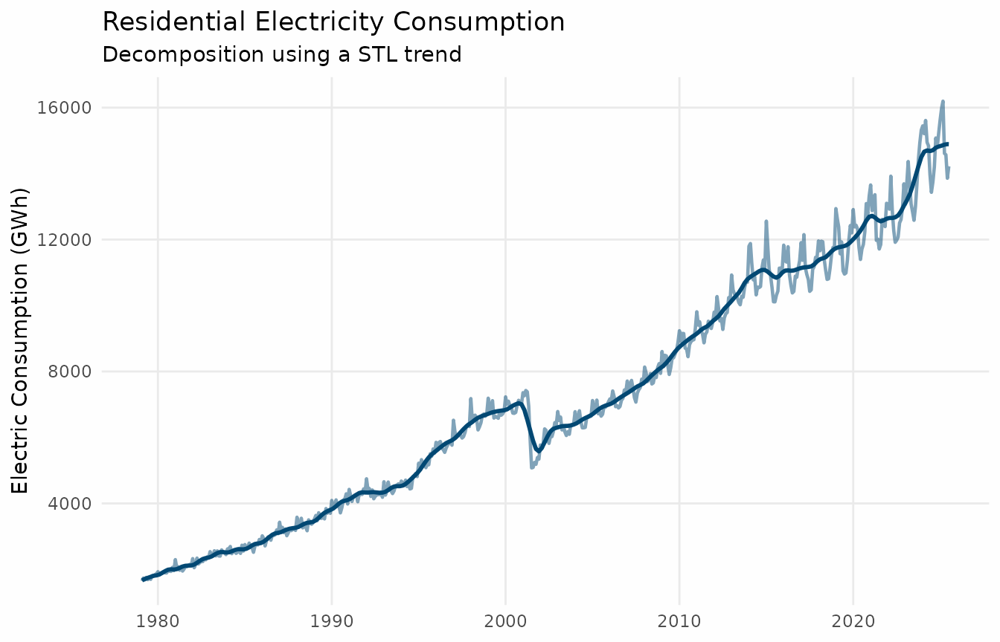
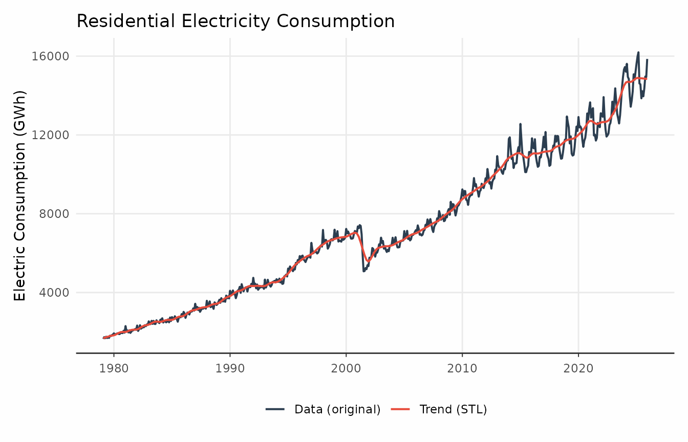
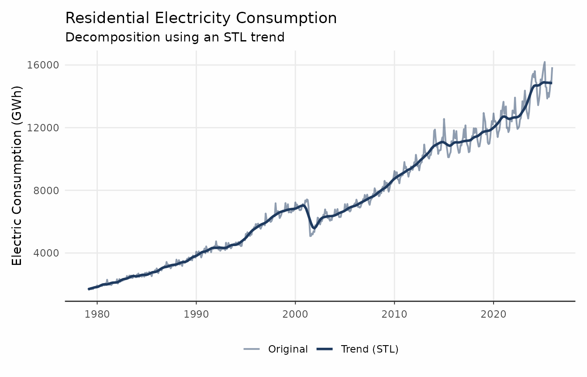
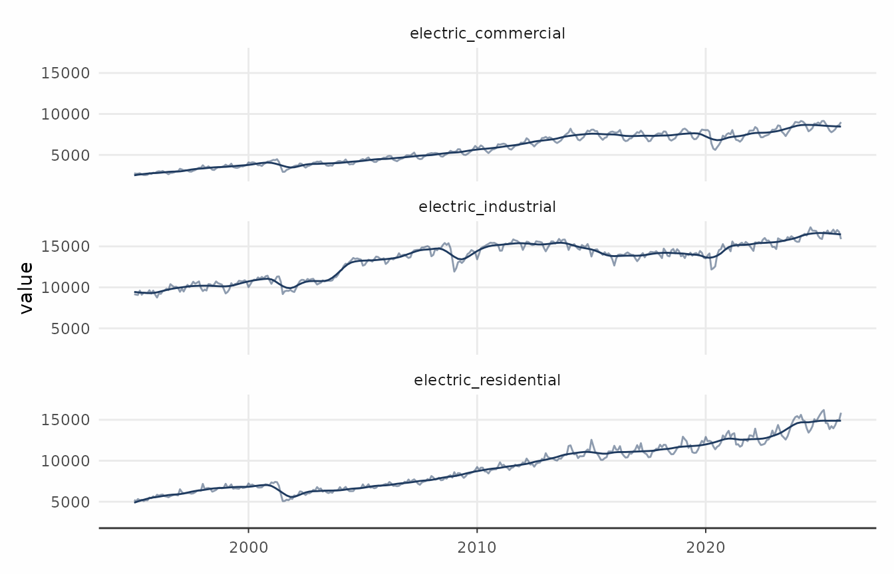
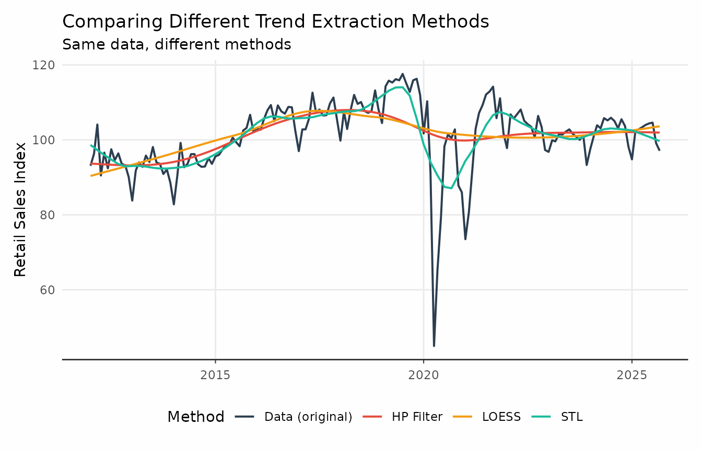
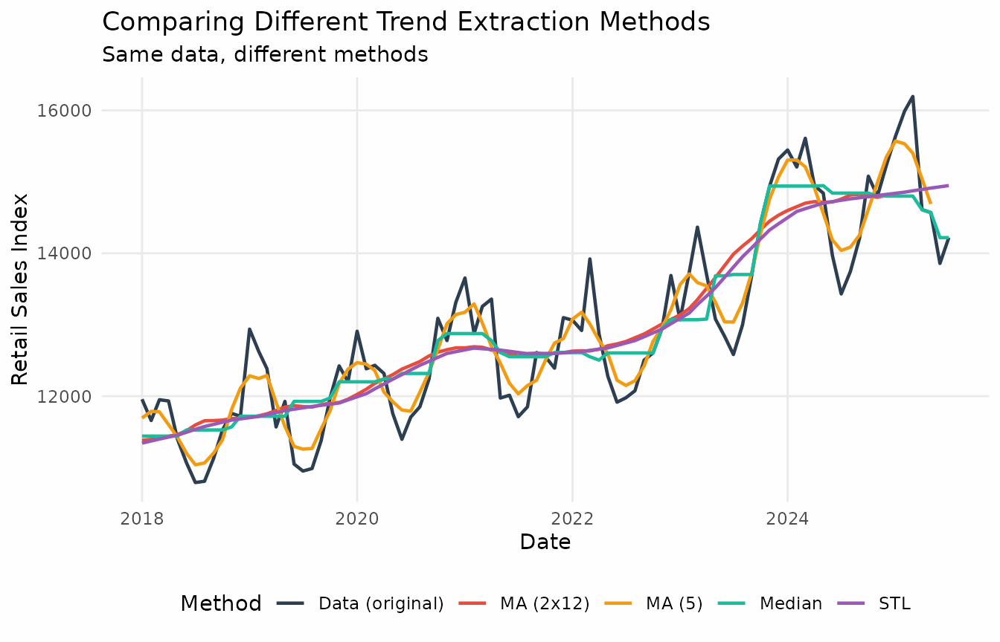

# Getting Started with trendseries

## What is trendseries?

The `trendseries` package helps you extract trends from economic time
series data. Trends can be broadly understood as the underlying
“direction” of the data, when stripped of its noise and seasonal
patterns.

The goal of `trendseries` is to provide a modern, pipe-friendly
interface for exploratory analysis of time series data in conventional
`data.frame` format. Throughout this vignette, the terms `data.frame`
and “data frame” will refer to any dataset in a rectangular format,
i.e., `data.frame`/`tibble`/`data.table`.

Working with time series can be quite cumbersome in R. Individual time
series are treated as a specific S3 class called `ts`. While base R
comes with a strong suite of built-in functions for time-series analysis
it’s hard to adapt this workflow with “modern R” which revolves around
data frames.

Tabular data frames are the most common format for time series data in
R, but most trend extraction methods are designed for `ts` objects.
`trendseries` aims to bridge this gap, allowing you to work directly
with data frames without time-consuming conversions between `ts` and
`data.frame`. `trendseries` was designed to work fluidly with
`tidyverse` tools like `dplyr` and `ggplot2`.

This package was designed with economic time series in mind, in this
sense, it includes methods commonly used in economics (e.g.,
Hodrick-Prescott filter) as well as general-purpose smoothing methods
(e.g., LOESS, moving averages).

## Getting started

`trendseries` revolves around a general wrapper function
`augment_trends` that adds news columns to a data frame.

``` r
library(trendseries)
library(dplyr)
library(ggplot2)

theme_series <- theme_minimal(paper = "#fefefe") +
  theme(
    legend.position = "bottom",
    panel.grid.minor = element_blank(),
    # Use colors
    palette.colour.discrete = c(
        "#2c3e50",
        "#e74c3c",
        "#f39c12",
        "#1abc9c",
        "#9b59b6"
    )
  )
```

This dataset contains monthly electric consumption for Brazilian
households from 1979 to 2025.

``` r
head(electric)
#> # A tibble: 6 × 2
#>   date       consumption
#>   <date>           <dbl>
#> 1 1979-02-01        1647
#> 2 1979-03-01        1736
#> 3 1979-04-01        1681
#> 4 1979-05-01        1757
#> 5 1979-06-01        1689
#> 6 1979-07-01        1730

ggplot(electric, aes(date, consumption)) +
  geom_line() +
  theme_series
```



To find the trend in data we use `augment_trends` and select a method:
in this case, STL (see
[`stats::stl`](https://rdrr.io/r/stats/stl.html)). We also need to
inform the names of the date column (“date” as default) and the value
column (“value”) as default.

``` r
elec_trend <- augment_trends(
  electric,
  value_col = "consumption",
  methods = "stl"
)

head(elec_trend)
#> # A tibble: 6 × 3
#>   date       consumption trend_stl
#>   <date>           <dbl>     <dbl>
#> 1 1979-02-01        1647     1666.
#> 2 1979-03-01        1736     1688.
#> 3 1979-04-01        1681     1710.
#> 4 1979-05-01        1757     1726.
#> 5 1979-06-01        1689     1743.
#> 6 1979-07-01        1730     1758.
```

`augment_trends` will do its best to try to infer the appropriate
frequency but this information can be supplied manually.

``` r
elec_trend <- augment_trends(
  electric,
  date_col = "date",
  value_col = "consumption",
  methods = "stl",
  frequency = 12
)
```

There are two options to visualize the data using `ggplot2`. The first
is to convert the data to a “long” format.

``` r
# Prepare data for plotting
plot_data <- elec_trend |>
  tidyr::pivot_longer(
    cols = -date,
    names_to = "series",
    values_to = "value"
  ) |>
  mutate(
    series = case_when(
      series == "consumption" ~ "Data (original)",
      series == "trend_stl" ~ "Trend (STL)"
    )
  )

# Create the plot
ggplot(plot_data, aes(x = date, y = value, color = series)) +
  geom_line(linewidth = 0.8) +
  labs(
    title = "Residential Electricity Consumption",
    x = NULL,
    y = "Electric Consumption (GWh)",
    color = NULL
  ) +
  theme_series
```



An alternative is to simply add the trend as an additional `geom_line`
layer. While this method is typically quicker, it doesn’t produce a
color legend. Depending on the audience of the plot, however, it might
be intuitive that the smooth line on top is the trend and that the other
line is the raw data.

``` r
ggplot(elec_trend, aes(x = date)) +
  geom_line(
    aes(y = consumption),
    linewidth = 0.8,
    alpha = 0.5,
    color = "#024873FF") +
  geom_line(
    aes(y = trend_stl),
    linewidth = 1,
    color = "#024873FF") +
  labs(
    title = "Residential Electricity Consumption",
    subtitle = "Decomposition using a STL trend",
    x = NULL,
    y = "Electric Consumption (GWh)",
    color = NULL
  ) +
  theme_series
```



### Multiple time series

`trendseries` makes it easy to compute trends across several series. One
or more grouping columns can be selected through the `group_vars`
argument.

``` r
cities <- c("Houston", "San Antonio", "Dallas", "Austin")

txtrend <- txhousing |>
  filter(city %in% cities, year >= 2010) |>
  mutate(date = lubridate::make_date(year, month, 1)) |>
  augment_trends(
    value_col = "median",
    group_vars = "city"
  )

ggplot(txtrend, aes(date)) +
  geom_line(aes(y = median), alpha = 0.5, color = "#024873FF") +
  geom_line(aes(y = trend_stl), color = "#024873FF") +
  facet_wrap(vars(city)) +
  theme_series
```



### Multiple trend methods

`trendseries` also facilitates extracting trends with different methods
simultaneously. The next example uses a chained index of retail sales of
automotive fuel in the UK. The original data comes from the UK Office
for National Statistics.

``` r
ggplot(retail_autofuel, aes(date, value)) +
  geom_line(lwd = 0.8, color = "#024873FF") +
  theme_series
```



This example also highlights how `augment_trends` fits neatly in a pipe
workflow.

``` r
fuel_trends <- retail_autofuel |>
  filter(date >= as.Date("2012-01-01")) |>
  augment_trends(
    methods = c("stl", "hp", "loess")
  )

comparison_plot <- fuel_trends |>
  tidyr::pivot_longer(
    cols = c(value, starts_with("trend_")),
    names_to = "method",
  ) |>
  mutate(
    method = case_when(
      method == "value" ~ "Data (original)",
      method == "trend_hp" ~ "HP Filter",
      method == "trend_stl" ~ "STL",
      method == "trend_loess" ~ "LOESS"
    )
  )

ggplot(comparison_plot, aes(x = date, y = value, color = method)) +
  geom_line(linewidth = 0.8) +
  labs(
    title = "Comparing Different Trend Extraction Methods",
    subtitle = "Same data, different methods",
    x = "Date",
    y = "Construction Index",
    color = "Method"
  ) +
  theme_series
```



## Finer control

Filter-extraction methods are spread across different packages and thus
use different conventions for parameter names. `trendseries` tries to
simplify this when possible. Methods like moving averages and moving
medians have a shared “window” argument that defines the size of the
rolling window.

``` r
elec_trends <- electric |>
  rename(value = consumption) |>
  # window controls the s.window argument by default
  augment_trends(methods = "stl", window = 17) |>
  # Creates a 11-month moving median
  augment_trends(methods = "median", window = 11) |>
  # Creates a (centerd) 5-month moving average
  augment_trends(methods = "ma", window = 5) |>
  # Creates a (centered) 2x12 moving average
  augment_trends(methods = "ma", window = 12)
```



`trendseries` tries to simplify trend extraction but this necessarily
comes at a cost of lost of precision. For instance, the
[`stats::stl`](https://rdrr.io/r/stats/stl.html) function has both a
`t.window` and `s.window` arguments. The `window` argument assumes the
user wants to control the `s.window` argument. This case illustrates how
trendseries tries to simplify the workflow by being opinionated about
default user choices.

``` r
df1 <- electric |>
  augment_trends(
    value_col = "consumption",
    methods = "stl",
    window = 21
  )

df2 <- electric |>
  augment_trends(
    value_col = "consumption",
    methods = "stl",
    params = list(s.window = 21)
  )
```

## How is `trendseries` easier than the traditional workflow?

Time series have a specific structure in R (`ts`) and most filtering
methods are designed for `ts` objects. However, datasets come as data
frames with date columns, which can make applying filters cumbersome.

The usual workflow involves (1) converting individual columns to `ts`,
(2) applying the filter, (3) and then converting back to a `data.frame`.
This can be cumbersome, especially when working with multiple series or
grouped data. Merging back the results with the original data can also
be error-prone due to misalignment of dates and additional `NA` values
introduced by some filters.

For instance, building an HP filter estimate of `gdp_construction`,
without `trendseries` requires one to first convert the data frame to a
`ts` object, mannually inputing both `frequency` and `start` parameters:

``` r
gdp_cons <- ts(
  gdp_construction$index,
  frequency = 4,
  start = c(1996, 1)
)

# Or, using lubridate to extract year and month
gdp_cons <- ts(
  gdp_construction$index,
  frequency = 4,
  start = c(lubridate::year(min(gdp_construction$date)),
            lubridate::quarter(min(gdp_construction$date)))
)
```

Then applying the HP filter using the `mFilter` package.

``` r
gdp_trend_hp <- mFilter::hpfilter(gdp_cons, 1600)
```

And finally, converting it back to a `data.frame` and merging it with
the original data.

``` r
# Convert back to data frame using tsbox
trend_df <- tsbox::ts_df(gdp_trend_hp$trend)
names(trend_df) <- c("date", "trend_hp")

# Join with original data
gdp_manual <- left_join(gdp_construction, trend_df, by = "date")
```

### What are the alternatives to `trendseries`?

The closest alternative to `trendseries` is the `tsibble`/`fable`
ecosystem, which provides a `model()` function for applying models —
including some trend extraction methods — to grouped time series. Like
`trendseries`, these packages integrate well with `tidyverse` tools and
pipes.

However, `fable` was designed primarily for forecasting, which means its
trend extraction capabilities are more limited. They also lack some
popular methods commonly used by economists, such as the HP filter and
the Hamilton filter.

Additionally, these packages require using the `tsibble` data structure,
which pulls users away from the familiar `data.frame`/`tibble` format.
For users working with just a few time series and relying on R’s
built-in `ts` functionality, the `tsibble` structure can feel
unnecessarily complex.

### Acknowledgements

This package was inspired by the need for a simpler workflow for trend
extraction in R. It builds upon many existing packages, including:

- `mFilter` for economic filters.
- `hpfilter` for Hodrick-Prescott filtering.
- `tsbox` for time series conversions.

### Getting Help

If you run into issues:

- Check the documentation:
  [`?augment_trends`](https://viniciusoike.github.io/trendseries/reference/augment_trends.md)
- View examples: `example(augment_trends)`
- Read other vignettes: `vignette(package = "trendseries")`
- Report bugs: GitHub issues
