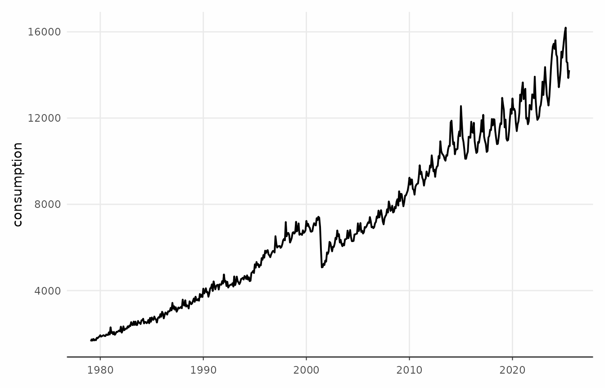
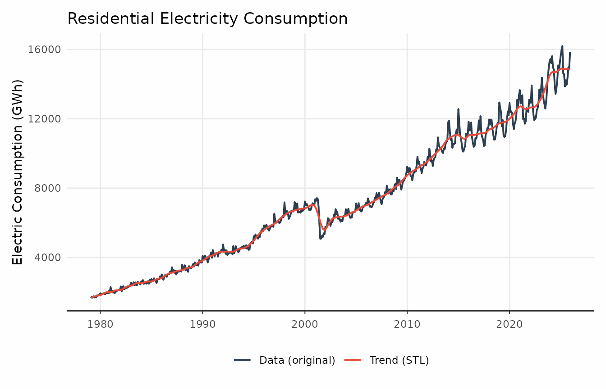
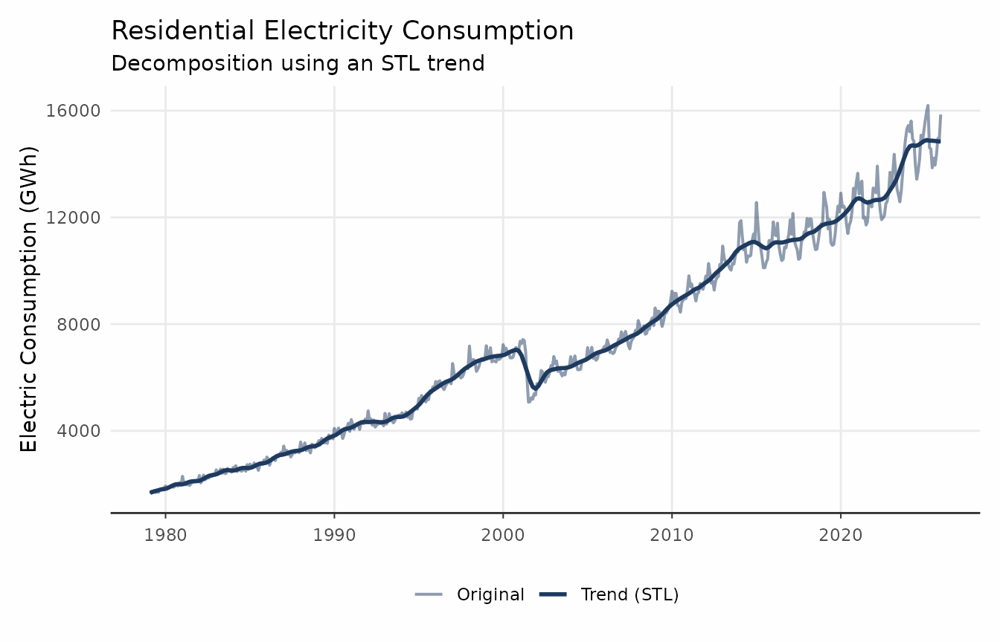
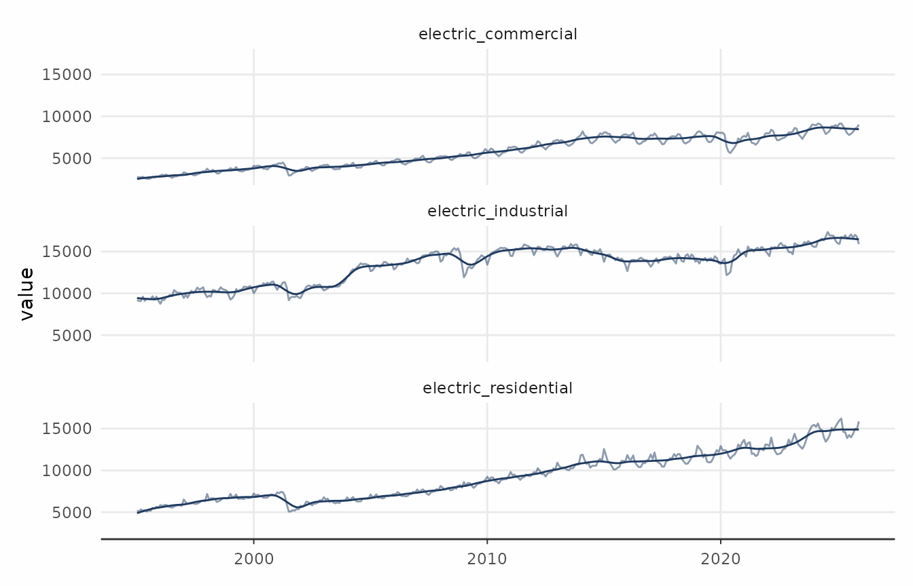
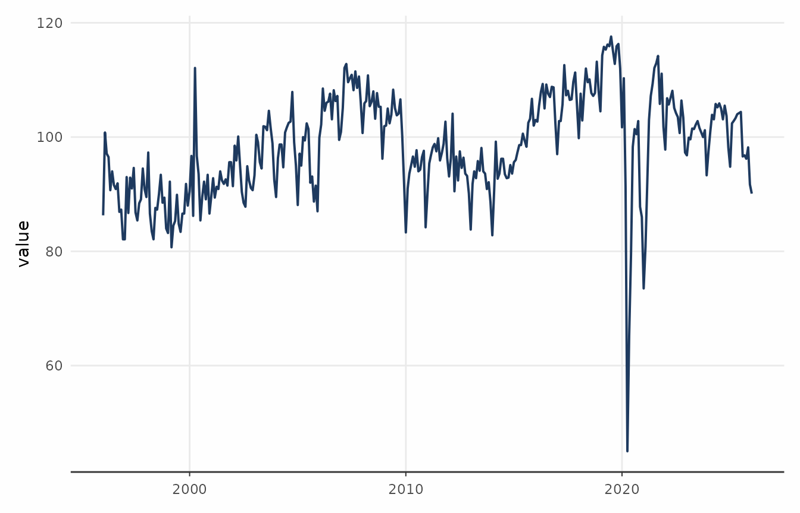
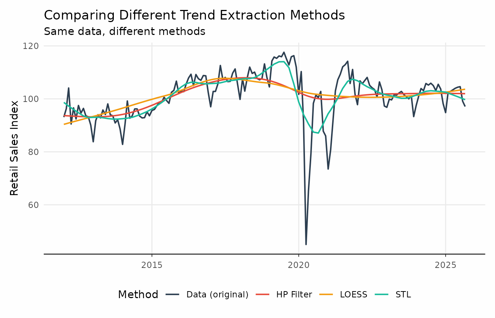
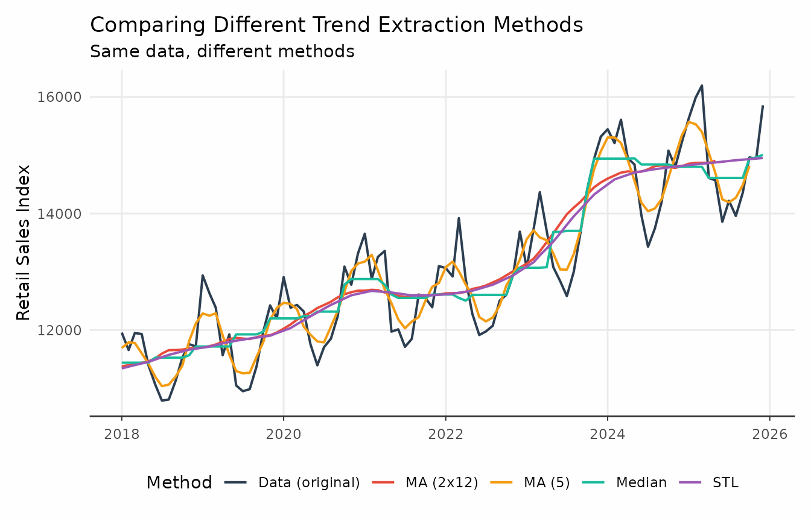

# Getting Started with trendseries

## What is trendseries?

The `trendseries` package helps you extract trends from time series
data. Trends can be broadly understood as the underlying “direction” of
the data, when stripped of its noise and seasonal patterns.

### Why trendseries?

Working with economic time series in R often involves cumbersome
conversions between data frames and `ts` objects. Most filtering methods
are designed for `ts` objects, but modern data analysis workflows use
`data.frame` objects with a date column. Converting back and forth
between `ts` and `data.frame` is tedious and error-prone.

The goal of `trendseries` is to provide a modern, pipe-friendly
interface for exploratory analysis of time series data in conventional
`data.frame` format. Throughout this vignette, the terms `data.frame`
and “data frame” will refer to any dataset in a rectangular format,
i.e., `data.frame`/`tibble`/`data.table`.

This package was designed with economic time series in mind. It includes
methods commonly used in economics (e.g., Hodrick-Prescott, Hamilton,
etc.) as well as general-purpose smoothing methods (e.g., LOESS, moving
averages).

## Getting started

`trendseries` revolves around a main function `augment_trends` that adds
new columns to a data frame. Note that `dplyr` isn’t required for
`trendseries` to work. In fact, `trendseries` should work with any
`data.frame` type object.

``` r

library(trendseries)
# Optional
library(dplyr)
library(tidyr, include.only = "pivot_longer")
```

The settings below are only defined for aesthetic purposes and can be
ignored.

``` r

library(ggplot2)

theme_series <- theme_minimal(paper = "#fefefe") +
  theme_sub_panel(grid.minor = element_blank()) +
  theme_sub_plot(margin = margin(10, 10, 10, 10)) +
  theme_sub_axis_x(
    line = element_line(color = "gray20"),
    ticks = element_line(color = "gray20", linewidth = 0.35),
    title = element_blank()
  ) +
  theme(
    legend.position = "bottom",
    # Use colors
    palette.colour.discrete = c(
        "#2c3e50",
        "#e74c3c",
        "#f39c12",
        "#1abc9c",
        "#9b59b6"
    )
  )
```

### Simple Example

`trendseries` comes with some useful datasets, some of which will
presented in this vignette. The `eletric` dataset contains monthly
electric consumption for Brazilian households from 1979 to 2025.

``` r

head(electric)
#> # A tibble: 6 × 2
#>   date       consumption
#>   <date>           <dbl>
#> 1 1979-02-01        1647
#> 2 1979-03-01        1736
#> 3 1979-04-01        1681
#> 4 1979-05-01        1757
#> 5 1979-06-01        1689
#> 6 1979-07-01        1730

ggplot(electric, aes(date, consumption)) +
  geom_line(lwd = 0.7) +
  theme_series
```



To estimate the trend we use `augment_trends` and select a method: in
this case, STL (see [`stats::stl`](https://rdrr.io/r/stats/stl.html)).
The `date_col` (default `"date"`) and `value_col` (default `"value"`)
arguments identify the relevant columns. The result is appended as a
column named `trend_{method}` such as “trend_stl”, “trend_ma” (for a
Moving Average), “trend_median” (for a Moving Median), etc.

``` r

elec_trend <- augment_trends(
  electric,
  date_col = "date",
  value_col = "consumption",
  methods = "stl"
)

head(elec_trend)
#> # A tibble: 6 × 3
#>   date       consumption trend_stl
#>   <date>           <dbl>     <dbl>
#> 1 1979-02-01        1647     1666.
#> 2 1979-03-01        1736     1688.
#> 3 1979-04-01        1681     1710.
#> 4 1979-05-01        1757     1726.
#> 5 1979-06-01        1689     1743.
#> 6 1979-07-01        1730     1758.
```

`augment_trends` will do its best to try to infer the appropriate
frequency but this information can be supplied manually.

``` r

elec_trend <- augment_trends(
  electric,
  date_col = "date",
  value_col = "consumption",
  methods = "stl",
  frequency = 12
)
```

There are two options to visualize the data using `ggplot2`. The first
is to convert the data to a “long” format and define a “name” for each
of the series.

``` r

# Prepare data for plotting
plot_data <- elec_trend |>
  tidyr::pivot_longer(
    cols = -date,
    names_to = "series",
    values_to = "value"
  ) |>
  mutate(
    series = case_when(
      series == "consumption" ~ "Data (original)",
      series == "trend_stl" ~ "Trend (STL)"
    )
  )

# Create the plot
ggplot(plot_data, aes(x = date, y = value, color = series)) +
  geom_line(linewidth = 0.7) +
  labs(
    title = "Residential Electricity Consumption",
    x = NULL,
    y = "Electric Consumption (GWh)",
    color = NULL
  ) +
  theme_series
```



An alternative is to add the trend as an additional `geom_line` layer.
This is quicker but doesn’t scale as well.

``` r

ggplot(elec_trend, aes(x = date)) +
  geom_line(
    aes(y = consumption, color = "Original"),
    linewidth = 0.7,
    alpha = 0.5
  ) +
  geom_line(
    aes(y = trend_stl, color = "Trend (STL)"),
    linewidth = 1
  ) +
  scale_color_manual(values = c("#1E3A5F", "#1E3A5F")) +
  labs(
    title = "Residential Electricity Consumption",
    subtitle = "Decomposition using an STL trend",
    x = NULL,
    y = "Electric Consumption (GWh)",
    color = NULL
  ) +
  theme_series
```



### Multiple time series

`trendseries` makes it easy to compute trends across several series. One
or more grouping columns can be selected through the `group_cols`
argument. Note that this works best for datasets in a “tidy” format. The
`txhousing` dataset comes from the `ggplot2` package.

``` r

cities <- c("Houston", "San Antonio", "Dallas", "Austin")

txtrend <- txhousing |>
  filter(city %in% cities, year >= 2010) |>
  mutate(date = lubridate::make_date(year, month, 1)) |>
  augment_trends(
    value_col = "median",
    group_cols = "city"
  )

ggplot(txtrend, aes(date)) +
  geom_line(aes(y = median), alpha = 0.5, color = "#1E3A5F") +
  geom_line(aes(y = trend_stl), color = "#1E3A5F") +
  facet_wrap(vars(city)) +
  theme_series
```



### Multiple trend methods

`trendseries` also facilitates extracting trends with different methods
simultaneously. The next example uses a chained index of retail sales of
automotive fuel in the UK. The original data comes from the UK Office
for National Statistics.

``` r

ggplot(retail_autofuel, aes(date, value)) +
  geom_line(lwd = 0.7, color = "#1E3A5F") +
  theme_series
```



This example also highlights how `augment_trends` fits neatly in a pipe
workflow.

``` r

fuel_trends <- retail_autofuel |>
  filter(date >= as.Date("2012-01-01")) |>
  augment_trends(
    methods = c("stl", "hp", "loess")
  )

comparison_plot <- fuel_trends |>
  tidyr::pivot_longer(
    cols = c(value, starts_with("trend_")),
    names_to = "method",
  ) |>
  mutate(
    method = case_when(
      method == "value" ~ "Data (original)",
      method == "trend_hp" ~ "HP Filter",
      method == "trend_stl" ~ "STL",
      method == "trend_loess" ~ "LOESS"
    )
  )

ggplot(comparison_plot, aes(x = date, y = value, color = method)) +
  geom_line(linewidth = 0.7) +
  labs(
    title = "Comparing Different Trend Extraction Methods",
    subtitle = "Same data, different methods",
    x = "Date",
    y = "Retail Sales Index",
    color = "Method"
  ) +
  theme_series
```



## Finer control

Filter-extraction methods are spread across different packages and thus
use different conventions for parameter names. `trendseries` tries to
simplify this when possible. Methods like moving averages and moving
medians have a shared “window” argument that defines the size of the
rolling window.

``` r

elec_trends <- electric |>
  rename(value = consumption) |>
  # window controls the s.window argument by default
  augment_trends(methods = "stl", window = 17) |>
  # Creates a 11-month moving median
  augment_trends(methods = "median", window = 11) |>
  # Creates a (centered) 5-month moving average
  augment_trends(methods = "ma", window = 5) |>
  # Creates a (centered) 2x12 moving average
  augment_trends(methods = "ma", window = 12)
```

``` r

comparison_plot <- elec_trends |>
  tidyr::pivot_longer(
    cols = c(value, starts_with("trend_")),
    names_to = "method",
  ) |>
  mutate(
    method = case_when(
      method == "value" ~ "Data (original)",
      method == "trend_median" ~ "Median",
      method == "trend_stl" ~ "STL",
      method == "trend_ma" ~ "MA (5)",
      method == "trend_ma_1" ~ "MA (2x12)"
    )
  ) |>
  filter(date >= as.Date("2018-01-01"))

ggplot(comparison_plot, aes(x = date, y = value, color = method)) +
  geom_line(linewidth = 0.7) +
  labs(
    title = "Comparing Different Trend Extraction Methods",
    subtitle = "Same data, different methods",
    x = "Date",
    y = "Retail Sales Index",
    color = "Method"
  ) +
  theme_series
```



Note that `trendseries` simplifies trend extraction at the cost of some
precision. For instance,
[`stats::stl`](https://rdrr.io/r/stats/stl.html) has both a `t.window`
and an `s.window` argument. The `window` argument in `trendseries`
controls `s.window` by default — an opinionated choice that favors
simplicity.

## FAQ

### How does `trendseries` compare to the traditional workflow?

The typical workflow of estimating trends from a single series involves:

1.  **Converting pairs of `date` and `numeric` columns to `ts`
    objects**. This usually means manually inputting both `frequency`
    and `start` parameters.
2.  **Applying a filter function to the `ts` object**.
3.  **Extracting the trend**. Since each filtering function returns a
    different type of object the complexity varies. For example
    [`stats::stl`](https://rdrr.io/r/stats/stl.html) requires
    `.$time.series[, "trend"]` and returns a `ts` object.
4.  **Converting the `ts` object back to the original `data.frame`**.

This can be cumbersome, especially when working with multiple series or
grouped data. Merging back the results with the original data can also
be error-prone due to misalignment of dates and additional `NA` values
introduced by some filters.

For instance, consider estimating a HP filter on `gdp_construction`. The
first step requires converting the data frame to a `ts` object, manually
inputting both `frequency` and `start` parameters.

``` r

gdp_cons <- ts(
  gdp_construction$index,
  frequency = 4,
  start = c(1996, 1)
)

# Or, using lubridate to extract year and month
gdp_cons <- ts(
  gdp_construction$index,
  frequency = 4,
  start = c(lubridate::year(min(gdp_construction$date)),
            lubridate::quarter(min(gdp_construction$date)))
)
```

Then applying the HP filter using the `mFilter` package.

``` r

gdp_trend_hp <- mFilter::hpfilter(gdp_cons, 1600)
```

And finally, converting it back to a `data.frame` and merging it with
the original data.

``` r

# Convert back to data frame using tsbox
trend_df <- tsbox::ts_df(gdp_trend_hp$trend)
names(trend_df) <- c("date", "trend_hp")

# Join with original data
gdp_manual <- left_join(gdp_construction, trend_df, by = "date")
```

### What are the alternatives to `trendseries`?

The closest alternative to `trendseries` is the `tsibble`/`fable`
ecosystem, which provides a `model()` function for applying models —
including some trend extraction methods — to grouped time series. Like
`trendseries`, these packages integrate well with `tidyverse` tools and
pipes.

However, `fable` was designed primarily for forecasting, which means its
trend extraction capabilities are more limited. They also lack some
popular methods commonly used by economists, such as the HP filter and
the Hamilton filter.

Additionally, these packages require using the `tsibble` data structure,
which pulls users away from the familiar `data.frame`/`tibble` format.
For users working with just a few time series and relying on R’s
built-in `ts` functionality, the `tsibble` structure can feel
unnecessarily complex.

## Acknowledgements

This package was inspired by the need for a simpler workflow for trend
extraction in R. It builds upon many existing packages, including:

- `mFilter` for economic filters.
- `hpfilter` for Hodrick-Prescott filtering.
- `tsbox` for time series conversions.

## Getting Help

If you run into issues:

- Check the documentation:
  [`?augment_trends`](https://viniciusoike.github.io/trendseries/reference/augment_trends.md)
- View examples: `example(augment_trends)`
- Read other vignettes: `vignette(package = "trendseries")`
- Report bugs: GitHub issues
