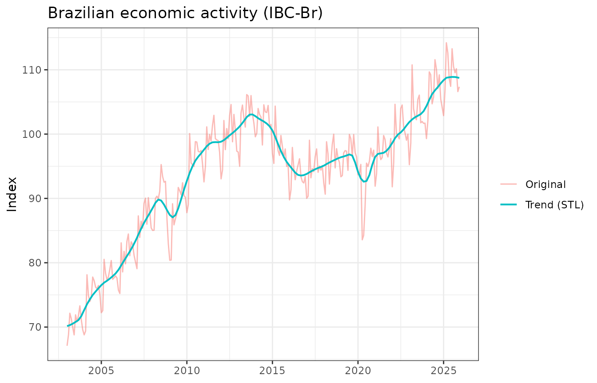
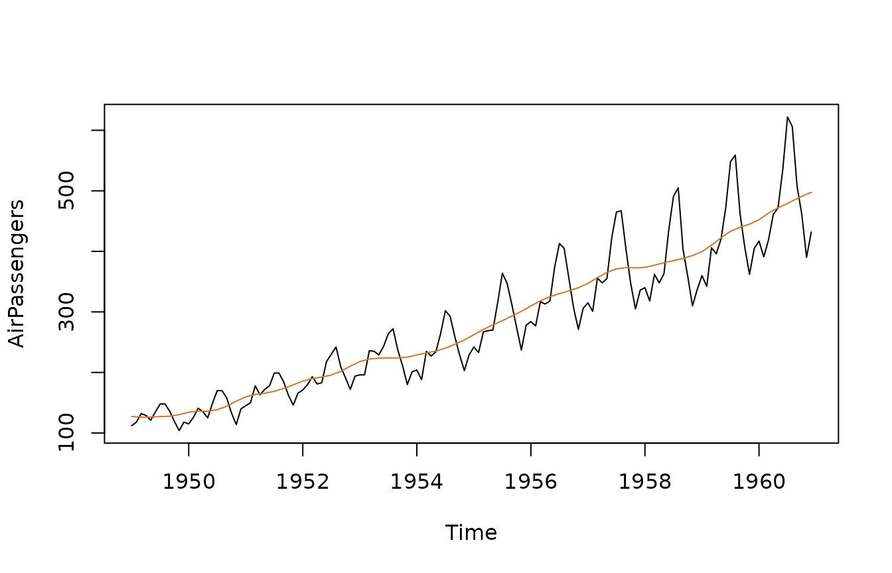

# Getting Started with trendseries

## What is trendseries?

The `trendseries` package is a suite of four functions for analyzing the
trend, seasonal, and cyclical structure of economic time series:

- **[`augment_trends()`](https://viniciusoike.github.io/trendseries/reference/augment_trends.md)**
  fits a smooth **trend** to a series.
- **[`decompose_series()`](https://viniciusoike.github.io/trendseries/reference/decompose_series.md)**
  splits a series into **trend**, **seasonal**, and **remainder**
  components.
- **[`deseason_series()`](https://viniciusoike.github.io/trendseries/reference/deseason_series.md)**
  removes the **seasonal** component, returning a seasonally adjusted
  series.
- **[`detrend_series()`](https://viniciusoike.github.io/trendseries/reference/detrend_series.md)**
  removes the trend, returning the **deviation from trend** — the cycle,
  or output gap.

All four share the same pipe-friendly `data.frame` interface, the same
20 underlying trend methods, and the same unified parameter system.
Throughout this vignette (and the package documentation generally) the
terms `data.frame` and “data frame” refer to any dataset in a
rectangular format, i.e., `data.frame`/`tibble`/`data.table`.

### Why trendseries?

Working with economic time series in R often involves cumbersome
conversions between data frames and `ts` objects. Most filtering methods
are designed for `ts` objects, but modern data analysis workflows use
`data.frame` objects with a date column. Converting back and forth
between `ts` and `data.frame` is tedious and error-prone.

The goal of `trendseries` is to provide a modern interface for
exploratory analysis of time series data in conventional `data.frame`
format, without giving up access to `ts`-native tools when you need
them: every function has a `ts`/`xts`/`zoo` counterpart
([`extract_trends()`](https://viniciusoike.github.io/trendseries/reference/extract_trends.md),
or the
`ts_col`/[`df_to_ts()`](https://viniciusoike.github.io/trendseries/reference/df_to_ts.md)
converters).

This package was designed with economic time series in mind. It includes
methods commonly used in economics (e.g., Hodrick-Prescott, Hamilton,
etc.) as well as general-purpose smoothing methods (e.g., LOESS, moving
averages).

## The four functions

Each function adds new columns to a data frame, named after the
component and the method used (`trend_stl`, `seasadj_stl`, `detrend_hp`,
etc.). The example below threads the same dataset — `ibcbr`, the Central
Bank’s monthly index of Brazilian economic activity — through all four.

``` r

ggplot(ibcbr, aes(date, index)) +
  geom_line(linewidth = 0.7) +
  theme_minimal() +
  labs(title = "Brazilian economic activity (IBC-Br)", x = NULL, y = "Index")
```



### `augment_trends()`: fit a trend

``` r

ibcbr_trend <- augment_trends(ibcbr, value_col = "index", methods = "stl")

head(ibcbr_trend)
#> # A tibble: 6 × 3
#>   date       index trend_stl
#>   <date>     <dbl>     <dbl>
#> 1 2003-01-01  67.1      70.2
#> 2 2003-02-01  68.8      70.2
#> 3 2003-03-01  72.2      70.3
#> 4 2003-04-01  71.3      70.4
#> 5 2003-05-01  70.0      70.5
#> 6 2003-06-01  68.8      70.7
```

### `decompose_series()`: split into trend, seasonal, and remainder

``` r

ibcbr_parts <- decompose_series(ibcbr, value_col = "index")

head(ibcbr_parts)
#> # A tibble: 6 × 5
#>   date       index trend_stl seasonal_stl remainder_stl
#>   <date>     <dbl>     <dbl>        <dbl>         <dbl>
#> 1 2003-01-01  67.1      70.2       -4.31         1.25  
#> 2 2003-02-01  68.8      70.2       -3.61         2.22  
#> 3 2003-03-01  72.2      70.3        3.50        -1.65  
#> 4 2003-04-01  71.3      70.4        0.159        0.726 
#> 5 2003-05-01  70.0      70.5       -0.473       -0.0703
#> 6 2003-06-01  68.8      70.7       -0.826       -1.05
```

### `deseason_series()`: remove seasonality

``` r

ibcbr_sa <- deseason_series(ibcbr, value_col = "index")

head(ibcbr_sa)
#> # A tibble: 6 × 3
#>   date       index seasadj_stl
#>   <date>     <dbl>       <dbl>
#> 1 2003-01-01  67.1        71.4
#> 2 2003-02-01  68.8        72.5
#> 3 2003-03-01  72.2        68.7
#> 4 2003-04-01  71.3        71.1
#> 5 2003-05-01  70.0        70.5
#> 6 2003-06-01  68.8        69.6
```

### `detrend_series()`: extract the cycle

``` r

ibcbr_cycle <- detrend_series(ibcbr, value_col = "index")

head(ibcbr_cycle)
#> # A tibble: 6 × 3
#>   date       index detrend_hp
#>   <date>     <dbl>      <dbl>
#> 1 2003-01-01  67.1     -1.93 
#> 2 2003-02-01  68.8     -0.482
#> 3 2003-03-01  72.2      2.53 
#> 4 2003-04-01  71.3      1.37 
#> 5 2003-05-01  70.0     -0.250
#> 6 2003-06-01  68.8     -1.75
```

### `extract_trends()`: the `ts`-native interface

Every trend method reachable through
[`augment_trends()`](https://viniciusoike.github.io/trendseries/reference/augment_trends.md)
is also reachable through
[`extract_trends()`](https://viniciusoike.github.io/trendseries/reference/extract_trends.md),
which takes `ts`/`xts`/`zoo` objects instead of data frames and returns
them, for users who prefer to stay in base R’s time series ecosystem.

``` r

stl_trend <- extract_trends(AirPassengers, methods = "stl")
plot.ts(AirPassengers)
lines(stl_trend, col = "#C53030")
```



## Where to go next

This vignette is intentionally just a map. Each function has its own
vignette with worked examples, parameter details, and guidance on
choosing between methods:

| Vignette | Covers |
|----|----|
| [Augmenting Trends](https://viniciusoike.github.io/trendseries/articles/augment-trends.html) | [`augment_trends()`](https://viniciusoike.github.io/trendseries/reference/augment_trends.md)/[`extract_trends()`](https://viniciusoike.github.io/trendseries/reference/extract_trends.md): grouping, multiple methods, finer control |
| [Decomposing Series](https://viniciusoike.github.io/trendseries/articles/decompose-series.html) | [`decompose_series()`](https://viniciusoike.github.io/trendseries/reference/decompose_series.md)/[`deseason_series()`](https://viniciusoike.github.io/trendseries/reference/deseason_series.md): trend/seasonal/remainder splits |
| [Detrending Series](https://viniciusoike.github.io/trendseries/articles/detrend-series.html) | [`detrend_series()`](https://viniciusoike.github.io/trendseries/reference/detrend_series.md): cycles, output gaps, the deseason-then-detrend workflow |
| [Trend Extraction Methods](https://viniciusoike.github.io/trendseries/articles/methods.html) | Catalogue of all 20 trend methods, by family |
| [Moving Averages](https://viniciusoike.github.io/trendseries/articles/moving-averages.html) | SMA, WMA, EWMA, Triangular, Median, Gaussian, Spencer, Henderson |
| [Econometric Filters](https://viniciusoike.github.io/trendseries/articles/econometric-filters.html) | HP, BK, CF, Hamilton, Beveridge-Nelson, UCM |

## Acknowledgements

This package was inspired by the need for a simpler workflow for trend
extraction in R. It builds upon many existing packages, including:

- `mFilter` for economic filters.
- `hpfilter` for Hodrick-Prescott filtering.
- `tsbox` for time series conversions.

## Getting Help

If you run into issues:

- Check the documentation:
  [`?augment_trends`](https://viniciusoike.github.io/trendseries/reference/augment_trends.md),
  [`?decompose_series`](https://viniciusoike.github.io/trendseries/reference/decompose_series.md),
  [`?deseason_series`](https://viniciusoike.github.io/trendseries/reference/deseason_series.md),
  [`?detrend_series`](https://viniciusoike.github.io/trendseries/reference/detrend_series.md)
- View examples: `example(augment_trends)`
- Read other vignettes: `vignette(package = "trendseries")`
- Report bugs: GitHub issues
