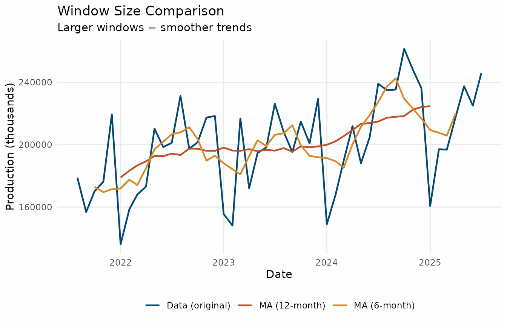

# Getting Started with trendseries

``` r
library(trendseries)
library(dplyr)
library(ggplot2)

theme_series <- theme_minimal(paper = "#fefefe") +
  theme(
    legend.position = "bottom",
    panel.grid.minor = element_blank(),
    # Use colors
    palette.colour.discrete = c(
      "#024873FF",
      "#BF4F26FF",
      "#D98825FF",
      "#D9AA1EFF",
      "#A2A637FF"
    )
  )
```

## What is trendseries?

The `trendseries` package helps you extract trends from economic time
series data. Think of trends as the underlying direction of your data,
stripped of short-term fluctuations and noise.

This vignette will walk you through the basics, starting with the
simplest possible example and gradually building up to more complex
analyses.

### Purpose

The main purpose of `trendseries` is to simplify the workflow of trend
extraction, especially when working with data frames and grouped data.
It provides two main functions:

- [`augment_trends()`](https://viniciusoike.github.io/trendseries/reference/augment_trends.md):
  Takes a data frame with a date column and a value column, and adds new
  columns with the extracted trends using specified methods.
- [`extract_trends()`](https://viniciusoike.github.io/trendseries/reference/extract_trends.md):
  Takes a single time series object (`ts`) and returns the extracted
  trends.

Tabular data frames are the most common format for time series data in
R, but most trend extraction methods are designed for `ts` objects.
`trendseries` bridges this gap, allowing you to work directly with data
frames without cumbersome conversions. `trendseries` was designed to
work fluidly with `tidyverse` tools like `dplyr` and `ggplot2`.

This package was designed with economic time series in mind, in this
sense, it includes methods commonly used in economics (e.g.,
Hodrick-Prescott filter) as well as general-purpose smoothing methods
(e.g., LOESS, moving averages).

### Your First Trend Analysis

Let’s start with the simplest possible example: extracting a trend from
Brazilian GDP construction data.

``` r
# Load the data
data("gdp_construction", package = "trendseries")

# Take a quick look
head(gdp_construction)
#> # A tibble: 6 × 2
#>   date       index
#>   <date>     <dbl>
#> 1 1995-01-01 100  
#> 2 1995-04-01 100  
#> 3 1995-07-01 100  
#> 4 1995-10-01 100  
#> 5 1996-01-01  97.8
#> 6 1996-04-01 101.
```

This dataset contains quarterly observations of Brazil’s construction
sector GDP. Let’s extract a trend using the Hodrick-Prescott (HP)
filter, one of the most common methods in economics.

``` r
# Extract trend using HP filter
gdp_with_trend <- augment_trends(
  gdp_construction,
  value_col = "index",
  methods = "hp"
)
#> Auto-detected quarterly (4 obs/year)
#> Computing HP filter (two-sided) with lambda = 1600

# View the result
head(gdp_with_trend)
#> # A tibble: 6 × 3
#>   date       index trend_hp
#>   <date>     <dbl>    <dbl>
#> 1 1995-01-01 100       101.
#> 2 1995-04-01 100       101.
#> 3 1995-07-01 100       102.
#> 4 1995-10-01 100       103.
#> 5 1996-01-01  97.8     103.
#> 6 1996-04-01 101.      104.
```

That’s it! The
[`augment_trends()`](https://viniciusoike.github.io/trendseries/reference/augment_trends.md)
function added a new column called `trend_hp` to your data. The original
data stays intact, and you get a new column with the trend.

### Visualizing Your First Trend

Let’s see what this trend looks like.

``` r
# Prepare data for plotting
plot_data <- gdp_with_trend |>
  select(date, index, trend_hp) |>
  tidyr::pivot_longer(
    cols = c(index, trend_hp),
    names_to = "series",
    values_to = "value"
  ) |>
  mutate(
    series = case_when(
      series == "index" ~ "Data (original)",
      series == "trend_hp" ~ "HP Filter Trend"
    )
  )

# Create the plot
ggplot(plot_data, aes(x = date, y = value, color = series)) +
  geom_line(linewidth = 0.8) +
  labs(
    title = "Brazil GDP Construction: Original vs Trend",
    x = "Date",
    y = "Construction Index",
    color = NULL
  ) +
  theme_series
```


Notice how the trend smooths out the short-term fluctuations in the
original data. This makes it easier to see the long-term direction of
the construction sector.

### What if my data is a sinlge time series?

If your data is already a `ts` object, you can use the
[`extract_trends()`](https://viniciusoike.github.io/trendseries/reference/extract_trends.md)
function directly. This is useful for quick analyses or when working
with single series.

``` r
gdp <- ts(
  gdp_construction$index,
  frequency = 4,
  start = c(1996, 1)
)

gdp_trend_hp <- extract_trends(gdp, "hp")
#> Computing HP filter (two-sided) with lambda = 1600
```

### Trying Different Trend Methods

The HP filter is just one way to extract trends. Let’s compare it with
two other popular methods.

- **HP filter**: Standard choice in macroeconomics
- **LOESS**: Local polynomial smoothing
- **Moving Average (MA)**: Simple average of nearby points

``` r
# Extract multiple trends at once
gdp_comparison <- gdp_construction |>
  augment_trends(
    value_col = "index",
    methods = c("hp", "loess", "ma")
  )
#> Auto-detected quarterly (4 obs/year)
#> Computing HP filter (two-sided) with lambda = 1600
#> Computing loess trend with span = 0.75
#> Computing 2x4-period MA (auto-adjusted for even-window centering)

# View the first few rows
gdp_comparison |>
  select(date, index, starts_with("trend_")) |>
  head()
#> # A tibble: 6 × 5
#>   date       index trend_hp trend_loess trend_ma
#>   <date>     <dbl>    <dbl>       <dbl>    <dbl>
#> 1 1995-01-01 100       101.        109.     NA  
#> 2 1995-04-01 100       101.        109.     99.7
#> 3 1995-07-01 100       102.        108.     99.6
#> 4 1995-10-01 100       103.        107.    101. 
#> 5 1996-01-01  97.8     103.        107.    102. 
#> 6 1996-04-01 101.      104.        106.    103.
```

Now let’s visualize all three methods:

``` r
# Prepare data for plotting
comparison_plot <- gdp_comparison |>
  select(date, index, starts_with("trend_")) |>
  tidyr::pivot_longer(
    cols = c(index, starts_with("trend_")),
    names_to = "method",
    values_to = "value"
  ) |>
  mutate(
    method = case_when(
      method == "index" ~ "Data (original)",
      method == "trend_hp" ~ "HP Filter",
      method == "trend_loess" ~ "LOESS",
      method == "trend_ma" ~ "Moving Average"
    )
  )

# Plot
ggplot(comparison_plot, aes(x = date, y = value, color = method)) +
  geom_line(linewidth = 0.8) +
  labs(
    title = "Comparing Different Trend Extraction Methods",
    subtitle = "Same data, different methods",
    x = "Date",
    y = "Construction Index",
    color = "Method"
  ) +
  theme_series
#> Warning: Removed 4 rows containing missing values or values outside the scale range
#> (`geom_line()`).
```


Each method produces a slightly different trend. The HP filter and LOESS
are quite similar, while the moving average is slightly more responsive
to changes in the data.

### Working with Monthly Data

So far we’ve used quarterly data (4 observations per year). Let’s try
monthly data, which is more common in economic analysis.

``` r
# Load monthly vehicle production data
data("vehicles", package = "trendseries")

# Look at recent data (last 4 years)
recent_vehicles <- vehicles |>
  slice_tail(n = 48)

head(recent_vehicles)
#> # A tibble: 6 × 2
#>   date       production
#>   <date>          <dbl>
#> 1 2021-08-01     178900
#> 2 2021-09-01     156803
#> 3 2021-10-01     170178
#> 4 2021-11-01     176322
#> 5 2021-12-01     219446
#> 6 2022-01-01     136105
```

The process is exactly the same -
[`augment_trends()`](https://viniciusoike.github.io/trendseries/reference/augment_trends.md)
automatically detects the frequency.

``` r
# Extract trend from monthly data
vehicles_with_trend <- vehicles |>
  augment_trends(
    value_col = "production",
    methods = "hp"
  )
#> Auto-detected monthly (12 obs/year)
#> Computing HP filter (two-sided) with lambda = 14400

vehicles_with_trend <- vehicles_with_trend |>
  tidyr::pivot_longer(
    cols = c(production, trend_hp),
    names_to = "series",
    values_to = "value"
  ) |>
  mutate(
    series = ifelse(series == "production", "Original", "HP Trend"),
    # To make sure the trend is plotted on top of the original series
    # configure levels accordingly
    series = factor(series, levels = c("Original", "HP Trend"))
  )

ggplot(vehicles_with_trend, aes(x = date, y = value, color = series)) +
  geom_line(linewidth = 0.8) +
  labs(
    title = "Brazil Vehicle Production: Monthly Data",
    subtitle = "Last 4 years of data",
    x = "Date",
    y = "Production (thousands of units)",
    color = NULL
  ) +
  theme_series
```


### Understanding Parameters: Window and Smoothing

Different trend methods accept different parameters. The `trendseries`
package simplifies this with two main parameters:

- **`window`**: Controls the period for moving averages (e.g., 12
  months)
- **`smoothing`**: Controls how smooth the trend should be

Let’s experiment with the `window` parameter for a moving average.

``` r
# Try different window sizes
vehicles_windows <- recent_vehicles |>
  augment_trends(
    value_col = "production",
    methods = "ma",
    window = 6
  ) |>
  rename(trend_ma_6m = trend_ma)
#> Auto-detected monthly (12 obs/year)
#> Computing 2x6-period MA (auto-adjusted for even-window centering)

# Add 12-month window
vehicles_windows <- vehicles_windows |>
  augment_trends(
    value_col = "production",
    methods = "ma",
    window = 12
  )
#> Auto-detected monthly (12 obs/year)
#> Computing 2x12-period MA (auto-adjusted for even-window centering)

# Visualize
vehicles_windows <- vehicles_windows |>
  select(date, production, trend_ma_6m, trend_ma) |>
  tidyr::pivot_longer(
    cols = c(production, trend_ma_6m, trend_ma),
    names_to = "method",
    values_to = "value"
  ) |>
  mutate(
    method = case_when(
      method == "production" ~ "Data (original)",
      method == "trend_ma_6m" ~ "MA (6-month)",
      method == "trend_ma" ~ "MA (12-month)"
    )
  )

ggplot(vehicles_windows, aes(x = date, y = value, color = method)) +
  geom_line(linewidth = 0.8) +
  labs(
    title = "Window Size Comparison",
    subtitle = "Larger windows = smoother trends",
    x = "Date",
    y = "Production (thousands)",
    color = NULL
  ) +
  theme_series
#> Warning: Removed 18 rows containing missing values or values outside the scale range
#> (`geom_line()`).
```



**Key insight**: Larger windows produce smoother trends but are slower
to react to changes. Smaller windows track the data more closely but may
still include some noise.

For monthly data: - Short-term trend: `window = 3` to `6` - Medium-term
trend: `window = 12` (one year) - Long-term trend: `window = 24` or more

### Working with Multiple Series

A common task is comparing trends across different time-series. Let’s
look at economic activity and vehicle production together.
[`augment_trends()`](https://viniciusoike.github.io/trendseries/reference/augment_trends.md)
can handle this easily with the `group_vars` argument.

``` r
data("ibcbr", package = "trendseries")

series <- full_join(ibcbr, vehicles, by = "date")

series <- series |>
  filter(date >= as.Date("2010-01-01")) |>
  tidyr::pivot_longer(
    cols = c(index, production),
    names_to = "indicator",
    values_to = "value"
  ) |>
  # Normalize to Jan 2010 = 100 for comparison
  mutate(
    norm_index = value / first(value) * 100,
    .by = indicator
  )

series <- augment_trends(
  series,
  value_col = "norm_index",
  methods = "hp",
  group_vars = "indicator"
)
#> Auto-detected monthly (12 obs/year)
#> Computing HP filter (two-sided) with lambda = 14400
#> Auto-detected monthly (12 obs/year)
#> Computing HP filter (two-sided) with lambda = 14400
```

``` r
# Plot trends only
series |>
  ggplot(aes(x = date, color = indicator)) +
  geom_line(aes(y = norm_index), alpha = 0.4) +
  geom_line(aes(y = trend_hp), linewidth = 1) +
  labs(
    title = "Economic Indicators: HP Filter Trends",
    subtitle = "Normalized to first observation = 100",
    x = "Date",
    y = "Index (normalized)",
    color = "Indicator"
  ) +
  theme_series
```


This shows both series moved together during the pandemic period but
diverged afterwards, with economic activity recovering more strongly
than vehicle production.

### Available Trend Methods

The `trendseries` package supports many trend extraction methods. Here
are the most commonly used:

#### Economic/Econometric Filters

- **`hp`**: Hodrick-Prescott filter (default, widely used in
  macroeconomics)
- **`bk`**: Baxter-King bandpass filter (isolates business cycles)
- **`cf`**: Christiano-Fitzgerald filter (asymmetric bandpass)
- **`hamilton`**: Hamilton regression filter (recent alternative to HP)

#### Moving Averages

- **`ma`**: Simple moving average (easiest to understand)
- **`ewma`**: Exponentially weighted moving average (more weight on
  recent data)
- **`wma`**: Weighted moving average (emphasizes recent observations)
- **`zlema`**: Zero-lag exponential moving average (reduced lag)
- **`triangular`**: Triangular moving average (double-smoothed)

#### Smoothing Methods

- **`loess`**: Local polynomial regression (flexible, data-adaptive)
- **`spline`**: Smoothing splines (very smooth)
- **`stl`**: Seasonal-trend decomposition (handles seasonality)

#### Advanced Methods

- **`sg`**: Savitzky-Golay filter (preserves features like peaks)
- **`kalman`**: Kalman smoother (optimal under certain assumptions)
- **`kernel`**: Kernel regression smoother (nonparametric)

**Recommendation for beginners**: Start with `hp` for general use, `ma`
when you want something simple and interpretable, and `stl` when your
data has clear seasonal patterns.

### Quick Reference: Common Patterns

Here are some ready-to-use patterns for common scenarios:

#### Basic trend extraction

``` r
# Single method, quarterly data
data |>
  augment_trends(value_col = "your_column", methods = "hp")

# Single series, monthly data
extract_trends(your_ts_data, method = "loess")
```

#### Compare multiple methods

``` r
data |>
  augment_trends(
    value_col = "your_column",
    methods = c("hp", "loess", "ma")
  )
```

#### Control smoothness

``` r
# Smoother HP filter (higher lambda)
data |>
  augment_trends(
    value_col = "your_column",
    methods = "hp",
    smoothing = 3200  # vs default 1600 for quarterly
  )

# Longer moving average window
data |>
  augment_trends(
    value_col = "your_column",
    methods = "ma",
    window = 24  # 2-year window for monthly data
  )
```

#### Grouped data

``` r
# Apply trend to multiple series at once
multi_series_data |>
  group_by(country) |>
  augment_trends(value_col = "gdp", methods = "hp") |>
  ungroup()

# Or using group_vars argument
multi_series_data |>
  augment_trends(
    value_col = "gdp",
    methods = "hp",
    group_vars = "country"
  )
```

### Next Steps

Now that you understand the basics, you can:

1.  **Explore specific methods in depth**: Check out the “Moving
    Averages” vignette for detailed analysis of MA methods.
2.  **Learn about economic filters**: See the “Economic Filters”
    vignette for HP, BK, and CF filters.
3.  **Try advanced methods**: Explore STL decomposition, Kalman
    filtering, and more in the “Advanced Methods” vignette.
4.  **Read the function documentation**:
    [`?augment_trends`](https://viniciusoike.github.io/trendseries/reference/augment_trends.md)
    and
    [`?extract_trends`](https://viniciusoike.github.io/trendseries/reference/extract_trends.md).

### Built-in Datasets

The package includes several economic datasets for practice.

#### Brazilian Economic Data

All series are monthly except for `gdp_construction`. - **`ibcbr`**:
Central Bank Economic Activity Index - smooth, good for learning -
**`vehicles`**: Vehicle production - cyclical, interesting patterns -
**`electric`**: Electricity consumption - seasonal patterns -
**`oil_derivatives`**: Oil derivatives production -
**`gdp_construction`**: GDP construction index - smooth, great for first
examples

#### International Data

- **`retail_households`**: UK household goods retail (monthly)
- **`retail_autofuel`**: UK automotive fuel retail (monthly)
- **`coffee_arabica`**: Coffee prices (daily)
- **`coffee_robusta`**: Coffee prices (daily)

## FAQ

### How is `trendseries` easier than the traditional workflow?

Time series have a specific structure in R (`ts`) and most filtering
methods are designed for `ts` objects. However, datasets come as data
frames with date columns, which can make applying filters cumbersome.

The usual workflow involves (1) converting individual columns to `ts`,
(2) applying the filter, (3) and then converting back to a `data.frame`.
This can be cumbersome, especially when working with multiple series or
grouped data. Merging back the results with the original data can also
be error-prone due to misalignment of dates and additional `NA` values
introduced by some filters.

For instance, to replicate the first example in this vignette, without
`trendseries`, you would have to first convert the data frame to a `ts`
object, mannually inputing both `frequency` and `start` parameters:

``` r
gdp_cons <- ts(
  gdp_construction$index,
  frequency = 4,
  start = c(1996, 1)
)

# Or, using lubridate to extract year and month
gdp_cons <- ts(
  gdp_construction$index,
  frequency = 4,
  start = c(lubridate::year(min(gdp_construction$date)),
            lubridate::quarter(min(gdp_construction$date)))
)
```

Then apply the HP filter using the `mFilter` package.

``` r
gdp_trend_hp <- mFilter::hpfilter(gdp_cons, 1600)
```

And finally, convert it back to a `data.frame` and merge with the
original data.

``` r
# Convert back to data frame using tsbox
trend_df <- tsbox::ts_df(gdp_trend_hp$trend)
names(trend_df) <- c("date", "trend_hp")

# Join with original data
gdp_manual <- left_join(gdp_construction, trend_df, by = "date")
```

### What are the alternatives to `trendseries`?

The closest alternative to `trendseries` is the `tsibble`/`fable`
ecosystem, which provides a `model()` function for applying models —
including some trend extraction methods — to grouped time series. Like
`trendseries`, these packages integrate well with `tidyverse` tools and
pipes.

However, `fable` was designed primarily for forecasting, which means its
trend extraction capabilities are more limited. They also lack some
popular methods commonly used by economists, such as the HP filter and
the Hamilton filter.

Additionally, these packages require using the `tsibble` data structure,
which pulls users away from the familiar `data.frame`/`tibble` format.
For users working with just a few time series and relying on R’s
built-in `ts` functionality, the `tsibble` structure can feel
unnecessarily complex.

### Acknowledgements

This package was inspired by the need for a simpler workflow for trend
extraction in R. It builds upon many existing packages, including:

- `mFilter` for economic filters.
- `hpfilter` for Hodrick-Prescott filtering.
- `signal` for Savitzky-Golay filtering.
- `TTR` and `zoo` for efficient moving averages.
- `tsbox` for time series conversions.

### Getting Help

If you run into issues:

- Check the documentation:
  [`?augment_trends`](https://viniciusoike.github.io/trendseries/reference/augment_trends.md)
- View examples: `example(augment_trends)`
- Read other vignettes: `vignette(package = "trendseries")`
- Report bugs: GitHub issues
