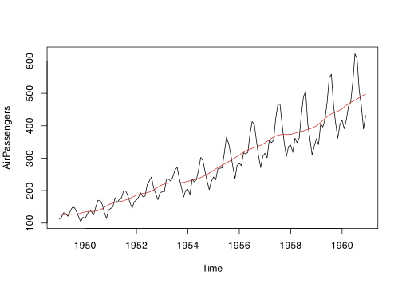

# trendseries: extract trends from time series

[](https://viniciusoike.r-universe.dev/trendseries)

`trendseries` provides a unified interface to extract trends, cycles,
and seasonal components from time series. Most filtering methods in R
are designed for `ts` objects, but datasets typically come in a
`data.frame` format with a date column, which makes applying filters
cumbersome. `trendseries` bridges this gap:
[`augment_trends()`](https://viniciusoike.github.io/trendseries/reference/augment_trends.md),
[`decompose_series()`](https://viniciusoike.github.io/trendseries/reference/decompose_series.md),
[`deseason_series()`](https://viniciusoike.github.io/trendseries/reference/deseason_series.md),
and
[`detrend_series()`](https://viniciusoike.github.io/trendseries/reference/detrend_series.md)
all work directly on `data.frame`/`tibble` objects, while
[`extract_trends()`](https://viniciusoike.github.io/trendseries/reference/extract_trends.md)
provides the same methods for `ts`/`xts`/`zoo` objects when you need to
stay in native time-series format.

## Installation

`trendseries` is available on CRAN

``` r

install.packages("trendseries")
```

You can install the development version of trendseries from
[GitHub](https://github.com/).

``` r

# install.packages("remotes")
remotes::install_github("viniciusoike/trendseries")
```

## Main Functions

The package provides four main functions for
`data.frame`/`tibble`/`data.table` workflows:

- **[`augment_trends()`](https://viniciusoike.github.io/trendseries/reference/augment_trends.md)**:
  adds trend columns to the original dataset.
- **[`decompose_series()`](https://viniciusoike.github.io/trendseries/reference/decompose_series.md)**:
  splits a series into trend, seasonal, and remainder components.
- **[`deseason_series()`](https://viniciusoike.github.io/trendseries/reference/deseason_series.md)**:
  wraps
  [`decompose_series()`](https://viniciusoike.github.io/trendseries/reference/decompose_series.md)
  to return a seasonally adjusted series.
- **[`detrend_series()`](https://viniciusoike.github.io/trendseries/reference/detrend_series.md)**:
  wraps
  [`augment_trends()`](https://viniciusoike.github.io/trendseries/reference/augment_trends.md)
  to return the deviation from trend (the cycle).

Each has a `ts`/`xts`/`zoo`-native counterpart via
**[`extract_trends()`](https://viniciusoike.github.io/trendseries/reference/extract_trends.md)**,
for workflows that stay in native time-series format.

## Usage

Time series have a specific structure in R (`ts`) and most filtering
methods are designed for `ts` objects. However, datasets typically come
in a `data.frame` format with a date column, which can make applying
filters cumbersome.

`trendseries` aims to make this process easy and flexible. The example
below computes three filters (HP, STL, and moving average) on a
quarterly index of construction activity. Note that the
[`augment_trends()`](https://viniciusoike.github.io/trendseries/reference/augment_trends.md)
function automatically detects the frequency of the data and uses
conventional defaults for the HP filter.

``` r

library(trendseries)
library(ggplot2)
data(gdp_construction)
# Computes multiple trends at once
series <- gdp_construction |>
  # Automatically detects frequency
  # Trends are added as new columns to the original dataset
  augment_trends(
    value_col = "index",
    methods = c("hp", "stl", "ma")
  )
#> Auto-detected quarterly (4 obs/year)
#> Computing HP filter (two-sided) with lambda = 1600
#> Computing STL trend with s.window = periodic
#> Computing 2x4-period MA (auto-adjusted for even-window centering)

series
#> # A tibble: 124 × 5
#>    date       index trend_hp trend_stl trend_ma
#>    <date>     <dbl>    <dbl>     <dbl>    <dbl>
#>  1 1995-01-01 100       101.     102.      NA  
#>  2 1995-04-01 100       101.     101.      99.7
#>  3 1995-07-01 100       102.     100.      99.6
#>  4 1995-10-01 100       103.      99.4    101. 
#>  5 1996-01-01  97.8     103.     101.     102. 
#>  6 1996-04-01 101.      104.     102.     103. 
#>  7 1996-07-01 107.      104.     103.     104. 
#>  8 1996-10-01 103.      105.     104.     106. 
#>  9 1997-01-01 101.      106.     106.     109. 
#> 10 1997-04-01 108.      106.     109.     111. 
#> # ℹ 114 more rows
```


An equivalent
[`extract_trends()`](https://viniciusoike.github.io/trendseries/reference/extract_trends.md)
function is also available for `ts` objects.

``` r

stl_trend <- extract_trends(AirPassengers, methods = "stl")
#> Computing STL trend with s.window = periodic
plot.ts(AirPassengers)
lines(stl_trend, col = "#C53030")
```



## Available Methods

`trendseries` supports 20 trend estimation methods, covering the most
commonly used approaches in econometrics and statistics. The [Trend
Extraction
Methods](https://viniciusoike.github.io/trendseries/articles/methods.html)
vignette describes each one — when to use it and which parameters it
takes.

| Method       | Category       | Description                            |
|--------------|----------------|----------------------------------------|
| `hp`         | econometric    | Hodrick-Prescott filter                |
| `hamilton`   | econometric    | Hamilton regression filter             |
| `bn`         | econometric    | Beveridge-Nelson decomposition         |
| `ucm`        | econometric    | Unobserved components model            |
| `bk`         | bandpass       | Baxter-King bandpass filter            |
| `cf`         | bandpass       | Christiano-Fitzgerald bandpass filter  |
| `ma`         | moving average | Simple moving average                  |
| `wma`        | moving average | Weighted moving average                |
| `ewma`       | moving average | Exponentially weighted moving average  |
| `triangular` | moving average | Triangular moving average              |
| `median`     | moving average | Median filter                          |
| `gaussian`   | moving average | Gaussian-weighted moving average       |
| `spencer`    | moving average | Spencer’s 15-term moving average       |
| `henderson`  | moving average | Henderson moving average               |
| `stl`        | smoothing      | Seasonal-trend decomposition via Loess |
| `loess`      | smoothing      | Local polynomial regression            |
| `spline`     | smoothing      | Smoothing splines                      |
| `poly`       | smoothing      | Polynomial trends                      |
| `kernel`     | smoothing      | Kernel smoother                        |
| `kalman`     | smoothing      | Kalman filter/smoother                 |

## Decomposition

To split a series into trend, seasonal, and remainder components, use
[`decompose_series()`](https://viniciusoike.github.io/trendseries/reference/decompose_series.md).
It supports STL, regression, classical moving-average, Basic Structural
Model (BSM), and X-13ARIMA-SEATS decomposition:

``` r

gdp_construction |>
  decompose_series(value_col = "index", methods = "stl")
```

See the [Decomposing
Series](https://viniciusoike.github.io/trendseries/articles/decompose-series.html)
vignette for details.

## Learn More

See the vignettes for detailed examples and usage patterns:

- [Introduction to
  trendseries](https://viniciusoike.github.io/trendseries/articles/trendseries.html)

- [Augmenting
  Trends](https://viniciusoike.github.io/trendseries/articles/augment-trends.html)

- [Trend Extraction
  Methods](https://viniciusoike.github.io/trendseries/articles/methods.html)

- [Moving
  Averages](https://viniciusoike.github.io/trendseries/articles/moving-averages.html)

- [Econometric
  Filters](https://viniciusoike.github.io/trendseries/articles/econometric-filters.html)

- [Decomposing
  Series](https://viniciusoike.github.io/trendseries/articles/decompose-series.html)

- [Detrending
  Series](https://viniciusoike.github.io/trendseries/articles/detrend-series.html)
